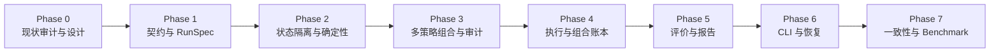

# 回测与量化研究平台实施计划

## 文档信息

| 项目 | 内容 |
| --- | --- |
| 状态 | 建议方案 |
| 适用范围 | 短线量化交易建议系统回测与量化研究平台 |
| 输入依据 | Phase 0 审计与设计文档 |
| 本轮目标 | 建立机构级回测与量化研究平台 Phase 1-7 实施路线图 |
| 最后更新 | 2026-07-03 |

**已确定**：本计划服务于研究性 Buy、Sell、Hold 信号与组合回测，不连接真实券商账户，不自动执行真实交易，不将回测结果描述为收益承诺。

---

## 1. 背景与目标

Phase 0 审计发现当前系统在单策略回测、数据契约和基础评价链路上已有扎实基础，但距离机构级回测平台存在显著差距：

- 事实层缺口：无 `BacktestRunSpec`、`BacktestRunManifest`、`Universe`、`StrategyBinding`、`ComposerDecision` 持久化
- 执行层缺口：无 T+1、涨跌停、整数手、市场规则引擎
- 报告层缺口：无自动报告生成；`EvaluationReportBuilder` 严重不足
- 治理层缺口：`VersionRegistry` 无锁、全局单例、无确定性测试
- 文档层缺口：多处文档规划与代码实现不一致

---

## 2. 总体路线图



---

## 3. 实施原则

1. **已确定**：每个 Phase 先完成设计文档，再实施代码。
2. **已确定**：每个 Phase 完成后，必须经过 Review（A. 架构、B. 量化正确性、C. 测试可靠性、D. 性能工程）才能进入下一 Phase。
3. **已确定**：Phase 1-4 是核心链路，不得绕过前置验收提前推进。
4. **建议方案**：每个 Phase 完成后，更新本文件状态看板和决策记录。
5. **建议方案**：所有待决策事项在落地前应先记录到 `docs/decisions/backtest-open-questions.md`，不得直接写成已确定实现。

---

## 4. Phase 详情

### Phase 1：契约与 RunSpec

**目标**：建立回测平台的事实层骨架，包括 `UniverseSnapshot`、`StrategyBinding`、`BacktestRunSpec`、`BacktestRunManifest`，以及对应的配置校验和 YAML 加载。

**退出条件**：

- `UniverseSnapshot`、`StrategyBinding`、`BacktestRunSpec`、`BacktestRunManifest` 契约测试通过
- `BacktestRunSpec.from_yaml()` 成功加载示例配置
- Universe 快照与 `AsOfDataset` as-of 语义正确
- 单元测试覆盖配置校验（`from_time < to_time`、Universe 可见性等）
- `VersionRegistry` 竞态问题已修复（加锁）

**交付物**：

- `src/quant_signal_system/backtest/run_spec.py`
- `src/quant_signal_system/backtest/manifest.py`
- `src/quant_signal_system/universe/contracts.py`
- `src/quant_signal_system/universe/repository.py`
- `src/quant_signal_system/universe/resolver.py`
- `src/quant_signal_system/config/versions.py`（修复无锁问题）
- `tests/backtest/test_run_spec.py`
- `tests/backtest/test_universe.py`
- `docs/architecture/backtest-execution-model.md`

**依赖**：Phase 0 审计结果。

**风险**：

- Universe 数据来源未决策（BT-TBD-07）：Phase 1 前必须决策
- `VersionRegistry` 无锁是 P1 高风险项：必须先修复

**Phase 1 之前的决策要求**（来自 `docs/decisions/backtest-open-questions.md`）：

- BT-TBD-05：事件排序（symbol 二级排序）
- BT-TBD-07：Universe 初始来源（建议手工 JSON）
- BT-TBD-15：存储格式（建议 JSON + SQLite）
- BT-TBD-26：RunSpec 配置格式（建议 YAML）

---

### Phase 2：状态隔离与确定性执行

**目标**：建立多 symbol、多 binding 的确定性执行基础，包括虚拟时钟、事件稳定排序、symbol/binding 隔离状态。

**退出条件**：

- `BacktestOrchestrator` 支持多 symbol 和多 `StrategyBinding` 独立运行
- 每个 `(binding_id, symbol)` 拥有独立的 `FeatureEngine` 实例
- `FrozenClock` 和 `VirtualClock` 与 `TradingCalendar` 正确交互
- 确定性测试通过：相同输入产生一致输出
- 属性测试覆盖 P1-P10（参见 `docs/architecture/backtest-testing-strategy.md`）

**交付物**：

- `src/quant_signal_system/backtest/orchestrator.py`
- `src/quant_signal_system/backtest/state_partition.py`
- `src/quant_signal_system/backtest/scheduler.py`
- `src/quant_signal_system/backtest/result.py`
- `src/quant_signal_system/time/clock.py`（扩展 `VirtualClock`）
- `tests/backtest/test_orchestrator.py`
- `tests/backtest/test_state_partition.py`
- `tests/property/test_determinism.py`
- `tests/property/test_money_conservation.py`
- `tests/property/test_t_plus_1_property.py`

**依赖**：Phase 1 完成。

**风险**：

- BT-TBD-01（FeatureEngine 隔离方案）：Phase 1 末尾评估
- BT-TBD-23（是否引入 `hypothesis`）：Phase 1 末尾评估

---

### Phase 3：多策略组合与审计

**目标**：实现 `ComposerDecision` 持久化、多策略冲突归因，以及 `OrderIntent` 的生成和持久化。

**退出条件**：

- `ComposerDecision` 持久化测试通过（重复写入幂等）
- 所有冲突场景（方向冲突、权重为零、全票失败）归因正确
- `ComposerCandidate.rejection_reason` 正确填充
- 多策略回测（同一 binding 不同策略 vs 不同 binding 独立运行）正确
- Golden Tests G1-G4 通过

**交付物**：

- `src/quant_signal_system/strategies/composer.py`（扩展：持久化接口）
- `src/quant_signal_system/backtest/order_intent.py`
- `tests/backtest/test_composer_decision.py`
- `tests/backtest/test_order_intent.py`
- `tests/golden/test_single_symbol_single_strategy.py`
- `tests/golden/test_single_symbol_multi_strategy.py`
- `tests/golden/test_multi_symbol_single_strategy.py`
- `tests/golden/test_multi_symbol_multi_strategy.py`
- `tests/golden/test_same_strategy_different_params.py`
- `docs/reviews/phase-3-review.md`

**依赖**：Phase 2 完成。

**风险**：

- BT-TBD-19（ComposerDecision 持久化时机）：已确定（立即写入）
- BT-TBD-20（多策略持仓隔离）：Phase 3 末尾决策

---

### Phase 4：执行与组合账本

**目标**：实现 A 股市场规则引擎、T+1 结算、现金账本和持仓管理，以及 `PortfolioMetrics` 计算。

**退出条件**：

- T+1 约束建模正确：当日买入不可卖
- 涨跌停阻断建模正确
- 整数手处理正确
- 现金守恒和借贷平衡测试通过
- `PortfolioMetrics` 计算正确
- Golden Tests G5-G9 通过

**交付物**：

- `src/quant_signal_system/execution/market_rules.py`
- `src/quant_signal_system/execution/order_model.py`
- `src/quant_signal_system/portfolio/ledger.py`
- `src/quant_signal_system/portfolio/settlement.py`
- `src/quant_signal_system/portfolio/cash.py`
- `src/quant_signal_system/portfolio/position.py`
- `src/quant_signal_system/portfolio/policy.py`
- `tests/backtest/test_market_rules.py`
- `tests/backtest/test_portfolio_ledger.py`
- `tests/golden/test_t_plus_1.py`
- `tests/golden/test_limit_up_down.py`
- `tests/golden/test_suspended.py`
- `tests/golden/test_lunch_break.py`
- `docs/reviews/phase-4-review.md`

**依赖**：Phase 3 完成。

**风险**：

- BT-TBD-10-12（A 股市场规则数据来源）：Phase 4 之前必须决策
- BT-TBD-13（零股处理）：Phase 4 之前必须决策

---

### Phase 5：评价与报告

**目标**：扩展信号评价到组合层评价，扩展报告生成到多维分桶，实现完整的回测产物生成。

**退出条件**：

- `SignalMetrics` 按 `(strategy_name, strategy_version, symbol, direction, reason_code, year, month)` 分桶正确
- `PortfolioMetrics` 计算正确（总收益、夏普、最大回撤、换手率）
- `BacktestRunManifest` 完整写入
- 所有产物文件生成（`manifest.json`, `signals.parquet`, `fills.parquet`, `evaluations.parquet`, `report.md`）
- 报告首页展示所有必需字段（run_id、数据版本、策略绑定、样本量、不可执行数量、警告）
- Golden Tests G10-G15 通过

**交付物**：

- `src/quant_signal_system/reporting/report_builder.py`（扩展）
- `src/quant_signal_system/reporting/dimensions.py`
- `src/quant_signal_system/reporting/tables.py`
- `src/quant_signal_system/reporting/artifacts.py`
- `src/quant_signal_system/evaluation/portfolio_evaluator.py`
- `tests/backtest/test_portfolio_evaluator.py`
- `tests/backtest/test_report_builder.py`
- `tests/golden/test_universe_change.py`
- `tests/golden/test_duplicate_bar.py`
- `tests/golden/test_missing_bar.py`
- `tests/golden/test_out_of_order_bar.py`
- `docs/reviews/phase-5-review.md`

**依赖**：Phase 4 完成。

**风险**：

- BT-TBD-15（存储格式）：Phase 1 已决策（JSON + SQLite）
- BT-TBD-17（信号/组合层报告分离）：Phase 5 末尾决策

---

### Phase 6：CLI 与恢复

**目标**：建立完整的 CLI 入口、失败恢复、幂等运行，以及 debug 模式。

**退出条件**：

- `python -m quant_signal_system.cli.run_backtest --spec config.yaml` 成功运行
- `python -m quant_signal_system.cli.validate_backtest --run-id xxx` 验证 Manifest 完整性
- `python -m quant_signal_system.cli.compare_runs --run-id-a xxx --run-id-b yyy` 比较两次运行
- 中断后重新运行幂等（无重复信号）
- 故障恢复测试通过（Phase 4 故障矩阵）
- Debug 模式导出事件链路
- 所有 Runbook 存在并经过演练

**交付物**：

- `src/quant_signal_system/cli/__init__.py`
- `src/quant_signal_system/cli/run_backtest.py`
- `src/quant_signal_system/cli/validate_backtest.py`
- `src/quant_signal_system/cli/compare_runs.py`
- `tests/backtest/test_cli_run_backtest.py`
- `tests/fault/test_mid_run_failure.py`
- `tests/fault/test_partial_persistence.py`
- `tests/fault/test_duplicate_task_execution.py`
- `tests/fault/test_data_interruption.py`
- `docs/runbooks/run-backtest.md`
- `docs/runbooks/debug-backtest-mismatch.md`
- `docs/runbooks/recover-failed-backtest.md`
- `docs/runbooks/analyze-backtest-report.md`
- `docs/reviews/phase-6-review.md`

**依赖**：Phase 5 完成。

---

### Phase 7：一致性、Fuzz 和 Benchmark

**目标**：建立历史回放一致性测试、实时影子对账、Fuzz 测试和性能基准。

**退出条件**：

- 历史回放一致性测试通过（C1-C6 断言）
- 实时影子对账测试通过
- Fuzz 测试运行 10000 次无崩溃
- Benchmark 基线建立：bars/s、多 symbol 扩展、多 binding 扩展、内存使用
- 性能文档建立（含数据规模、硬件、软件版本、结果）

**交付物**：

- `tests/consistency/test_replay_consistency.py`
- `tests/consistency/test_live_vs_replay.py`
- `tests/reconciliation/test_shadow_reconciliation.py`
- `tests/fuzz/test_runspec_fuzz.py`
- `tests/fuzz/test_bar_sequence_fuzz.py`
- `tests/fuzz/test_universe_fuzz.py`
- `tests/fuzz/test_composer_fuzz.py`
- `tests/benchmark/benchmark_backtest.py`
- `docs/benchmark/benchmark-20260703.md`
- `docs/reviews/phase-7-review.md`

**依赖**：Phase 6 完成。

---

## 5. Review 流程

每个 Phase 完成后，必须以四个角色独立 Review：

| Reviewer | 关注点 |
| --- | --- |
| A. 架构与模块边界 | 职责清晰；依赖方向；无循环依赖；无隐式共享状态；不过度设计 |
| B. 量化正确性 | 前视偏差；数据泄漏；时间语义；复权；as-of；未闭合 Bar；成交价格；成本；T+1；评价口径；信号与组合收益不混淆 |
| C. 测试与可靠性 | 不只覆盖 happy path；幂等；故障恢复；确定性；状态隔离；边界条件；可诊断性；运行产物完整性 |
| D. 性能与工程 | 无不必要复制；时间/内存复杂度；多 symbol/策略扩展；类型和异常设计；新依赖合理性 |

Review 输出到 `docs/reviews/phase-N-review.md`，分为 Blocker / Major / Minor / Suggestion。所有 Blocker 必须修复。

---

## 6. 测试命令规划

```powershell
# Phase 1+
pytest tests/backtest/test_run_spec.py
pytest tests/backtest/test_universe.py

# Phase 2+
pytest tests/backtest/test_orchestrator.py
pytest tests/property/

# Phase 3+
pytest tests/golden/

# Phase 4+
pytest tests/backtest/test_market_rules.py
pytest tests/backtest/test_portfolio_ledger.py

# Phase 5+
pytest tests/backtest/test_report_builder.py

# Phase 6+
pytest tests/fault/

# Phase 7+
pytest tests/consistency/
pytest tests/fuzz/
pytest tests/benchmark/
```

---

## 7. 状态看板

| 编号 | Phase | 状态 | 备注 |
| --- | --- | --- | --- |
| P0 | Phase 0 审计与设计 | **已完成** | 8 份文档已生成 |
| P1 | Phase 1 契约与 RunSpec | 待开始 | |
| P2 | Phase 2 状态隔离与确定性 | 待开始 | |
| P3 | Phase 3 多策略组合与审计 | 待开始 | |
| P4 | Phase 4 执行与组合账本 | 待开始 | |
| P5 | Phase 5 评价与报告 | 待开始 | |
| P6 | Phase 6 CLI 与恢复 | 待开始 | |
| P7 | Phase 7 一致性与 Benchmark | 待开始 | |

---

## 8. 已确定决策汇总

| 编号 | 决策 | Phase | 来源 |
| --- | --- | --- | --- |
| DEC-BT-001 | Backtest 无 Manifest 则运行失败 | P1 | BLOCK-01 |
| DEC-BT-002 | ComposerDecision 必须持久化 | P3 | BLOCK-07 |
| DEC-BT-003 | T+1 建模在 Phase 4 实施 | P4 | BLOCK-04 |
| DEC-BT-004 | Report 由事实派生，不在 Runner 内拼接 | P5 | 架构原则 |
| DEC-BT-005 | Phase 1 不引入多线程/并行 | P1 | 避免过早复杂度 |
| DEC-BT-006 | 属性测试引入需 ADR | P1 | BT-TBD-23 |
| DEC-BT-007 | Golden Case 变更必须 Review | 全部 | 防止意外破坏 |
| DEC-BT-008 | 确定性测试是 Phase 7 的一部分 | P7 | 无基线数据 |
| DEC-BT-009 | 报告必须展示样本量和不可执行样本 | P5 | 量化正确性 |
| DEC-BT-010 | 不同版本不得在报告中混合 | P5 | 数据契约 |

---

## 9. 风险与缓解

| 编号 | 风险 | Phase | 缓解 |
| --- | --- | --- | --- |
| RISK-BT-01 | A 股市场规则数据来源未决策 | P1-4 | Phase 4 前必须决策（BT-TBD-10-12） |
| RISK-BT-02 | `VersionRegistry` 无锁（多线程不安全） | P1 | Phase 1 第一个任务 |
| RISK-BT-03 | Universe 数据来源未决策 | P1 | Phase 1 前决策（BT-TBD-07） |
| RISK-BT-04 | 报告能力在 Phase 5 才完整 | P1-4 | Phase 4 末尾可生成简单摘要 |
| RISK-BT-05 | 属性测试引入依赖评估 | P1 | Phase 1 末尾评估（BT-TBD-23） |
| RISK-BT-06 | Golden Case 规模失控 | 全部 | 每个 Case 不超过 30 个 bar |
