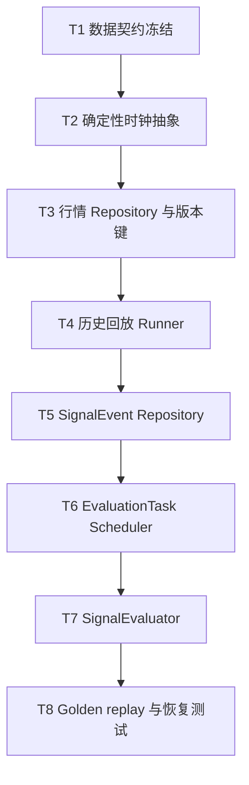

# 工程实施计划

## 1. 文档状态

| 项目 | 内容 |
| --- | --- |
| 状态 | 建议方案 |
| 适用范围 | 短线量化交易建议与有效性评价系统 |
| 输入依据 | `docs/architecture/` 已评审文档、`docs/input/original-quant-signal-plan.md`、`AGENTS.md` |
| 本轮目标 | 在既有计划基础上实现除双源对账外的研究系统 v1 骨架 |
| 最后更新 | 2026-07-03 |

已确定：本计划服务于研究性 Buy、Sell、Hold 信号、历史回放、离线回测、实时影子评价和模拟成交分析，不连接真实券商账户，不自动执行真实交易，不将回测结果描述为收益承诺。

已确定：第一优先级是数据契约、确定性时钟抽象、行情回放能力、`SignalEvent` 持久化、延迟评价器和测试夹具。

已确定：Dashboard/API 和机器学习模型不作为早期优先事项。它们只能在核心数据、评价、回放、测试和影子对账能力稳定后进入后续阶段。

## 2. 实施原则

1. 已确定：所有价格评价必须基于信号产生后现实可获得的价格。
2. 已确定：不允许使用未来数据、未来修订数据或信号时刻尚未闭合的 K 线。
3. 已确定：历史 `SignalEvent` 不可修改，策略或数据变化只能产生新版本信号或新评价结果。
4. 已确定：实时、历史回放和回测必须复用相同的特征与策略核心。
5. 建议方案：第一版采用模块化单体，保留清晰接口边界，不提前引入微服务、复杂消息总线或机器学习训练平台。
6. 建议方案：每个阶段先通过系统正确性与量化正确性验收，再讨论信号表现。
7. 待决策：具体数据库、行情供应商、交易日历、费用滑点参数和部署环境仍需后续决策。

## 3. 总体路线图


已确定：`E1` 至 `E4` 是当前最高优先级。`E5` 之后不得绕过前置验收提前推进。

## 4. 并行与串行关系

### 4.1 必须串行的主链路



已确定：该链路必须串行推进，因为后续任务依赖前一阶段的数据语义、时间语义和幂等键。

### 4.2 可并行推进的工作

| 工作 | 可并行原因 | 不得越界 |
| --- | --- | --- |
| 测试夹具目录与样本规范 | 只依赖数据契约草案，必须前置 | 不写策略业务逻辑 |
| 配置与版本管理骨架 | 只依赖版本字段定义 | 不实现参数搜索或 ML |
| 可观测性指标命名规范 | 只依赖架构文档 | 不设置未经基准验证的阈值 |
| 文档与 ADR 模板 | 不影响业务代码 | 不把待决策写成已确定 |
| 存储迁移草案 | 可在契约稳定后并行 | 不锁死数据库选型，除非决策完成 |

## 5. Epic、Milestone 和 Task

### Epic 0：工程脚手架与治理

目标：建立可持续实施的工程边界、目录约定、质量门禁和决策记录机制。

退出条件：项目能在空实现状态下运行格式检查、类型检查和测试发现；`PLANS.md`、ADR、开放问题和任务状态有固定维护位置。

#### Milestone 0.1：项目结构与质量门禁

| Task | 状态 | 可并行 | 输入 | 输出 | 依赖 | 风险 | 验收条件 |
| --- | --- | --- | --- | --- | --- | --- | --- |
| T0.1 建立 Python 包目录骨架 | 建议方案 | 是 | `docs/architecture/module-design.md` | `src/quant_signal_system/` 目录与空模块 | 无 | 目录过度拆分或与架构不一致 | 目录职责与本计划第 6 节一致，无业务实现 |
| T0.2 建立测试目录骨架 | 建议方案 | 是 | `docs/architecture/testing-and-evaluation.md` | `tests/unit`、`tests/contract`、`tests/property`、`tests/replay`、`tests/recovery`、`tests/reconciliation`、`tests/observability`、`tests/fixtures/manifest.yml`、`tests/fixtures/golden/expected/` | T0.1 | 测试夹具散落难维护 | 每个 Golden case 能声明输入、版本、期望输出和人工计算说明 |
| T0.3 建立质量命令 | 建议方案 | 是 | 现有工具链待确认 | `README` 或 Make/脚本中的 test/lint/type 命令 | T0.1 | 工具选型与环境冲突 | 命令可执行，即使初期只运行空测试 |
| T0.4 建立 ADR 与状态维护规则 | 建议方案 | 是 | `docs/decisions/open-questions.md` | `docs/decisions/` 下 ADR 模板或索引 | 无 | 决策散落在聊天或代码注释 | 新增决策能标记已确定/建议方案/待决策 |

### Epic 1：数据契约与确定性时钟

目标：先定义所有事实对象、时间语义、价格语义和版本键，为后续实现提供不可歧义的边界。

退出条件：`MarketTick`、`MarketBar`、`FeatureSnapshot`、`MarketRegime`、`SignalEvent`、`EvaluationTask`、`SignalEvaluation`、`StrategyVersion`、`PaperOrder`、`PaperFill`、`PaperPosition` 的契约测试通过；时钟抽象可在测试中固定时间。

#### Milestone 1.1：核心契约模型

| Task | 状态 | 可并行 | 输入 | 输出 | 依赖 | 风险 | 验收条件 |
| --- | --- | --- | --- | --- | --- | --- | --- |
| T1.1 定义契约模型骨架 | 建议方案 | 否 | `docs/architecture/data-contracts.md` | `contracts/market.py`、`contracts/signal.py`、`contracts/evaluation.py`、`contracts/portfolio.py` | T0.1 | 字段遗漏导致后续迁移 | 必填字段、版本字段、时间字段、价格字段与架构文档一致 |
| T1.2 定义枚举和值对象 | 建议方案 | 是 | 数据契约和术语表 | `Direction`、`SignalAction`、`ExecutionStatus`、`BarrierConflictPolicy` 等 | T1.1 | Sell 被误解为做空 | `Sell` 相关枚举明确为风险降低或减仓，不自动建空仓 |
| T1.3 定义契约校验规则 | 建议方案 | 否 | T1.1、T1.2 | 字段级校验与跨字段校验 | T1.1 | 校验过弱导致非法事实入库 | 非法样本能拒绝：缺字段、时间倒挂、未闭合 Bar、版本缺失 |
| T1.4 建立 schema version 策略 | 建议方案 | 是 | 数据契约文档 | `schema_version` 命名与兼容策略 | T1.1 | 早期 schema 演进不可追踪 | 旧样本读取策略和新增字段策略清晰 |

#### Milestone 1.2：确定性时钟抽象

| Task | 状态 | 可并行 | 输入 | 输出 | 依赖 | 风险 | 验收条件 |
| --- | --- | --- | --- | --- | --- | --- | --- |
| T1.5 定义 `Clock` 接口 | 建议方案 | 否 | 时间语义 | `Clock.now()`、`Clock.market_now()` 等接口骨架 | T1.1 | 系统时间散落，测试不可复现 | 核心模块不直接调用系统时间 |
| T1.6 实现测试用 `FrozenClock` 规划 | 建议方案 | 是 | T1.5 | 固定时间、推进时间、交易时段边界测试设计 | T1.5 | 延迟评价无法确定性测试 | 可模拟信号时间、到期时间和重启恢复 |
| T1.7 定义交易日历接口 | 建议方案 | 是 | 开放问题 TBD-02 | `TradingCalendar` 接口骨架 | T1.5 | 日历来源未定导致逻辑硬编码 | 接口隔离来源，未决策项留在配置层 |

#### Milestone 1.3：版本治理与前置测试资产

| Task | 状态 | 可并行 | 输入 | 输出 | 依赖 | 风险 | 验收条件 |
| --- | --- | --- | --- | --- | --- | --- | --- |
| T1.8 定义 `VersionRegistry` / `ConfigSnapshot` 骨架 | 建议方案 | 是 | `StrategyVersion` 与评价契约 | `feature_version`、`evaluation_policy_version`、`cost_model_version`、`fill_model_version`、`parameter_hash` 的冻结和校验规则 | T1.1 | 版本字段存在但无法稳定生成 | 每个 run、`SignalEvent`、`SignalEvaluation` 都能引用稳定版本快照 |
| T1.9 建立契约样本库 | 建议方案 | 否 | T1.1、T1.3 | `tests/fixtures/contracts/valid`、`tests/fixtures/contracts/invalid` | T1.3 | 契约实现后才补样本导致遗漏 | 缺字段、时间错位、未闭合 Bar、版本缺失均有负例；拒绝原因结构化且可断言 |
| T1.10 规划 `AsOfDataset` / `ReferenceDataRepository` | 建议方案 | 是 | `MarketRegime`、外部数据 as-of 约束 | 指数成分、行业/板块、复权因子、交易状态的 `available_at`、`effective_time`、`revision_id`、`as_of_version` 契约 | T1.1 | 未来可见的成分或复权数据进入特征 | 未来行业成分、未来复权因子、供应商修订数据 fixture 必须被拒绝或生成新版本 replay |

### Epic 2：行情存储与历史回放

目标：建立标准化行情的版本化存储与可重复回放能力，为实时/回放一致性奠定基础。

退出条件：固定 fixture 可以按 `market_data_time` 顺序重放；重复、乱序、迟到和修订数据能被识别；同一输入重复运行输出一致。

#### Milestone 2.1：Market Data Repository

| Task | 状态 | 可并行 | 输入 | 输出 | 依赖 | 风险 | 验收条件 |
| --- | --- | --- | --- | --- | --- | --- | --- |
| T2.1 定义 `MarketDataSource` 接口 | 建议方案 | 是 | 模块设计核心接口 | read/stream 接口骨架 | T1.1 | 数据源接口泄漏供应商字段 | 策略核心只依赖内部契约 |
| T2.2 定义 `MarketDataRepository` 接口 | 建议方案 | 否 | `MarketBar` 契约 | save/read/query_missing 接口骨架 | T1.1 | 版本键不足导致修订覆盖旧事实 | 唯一键包含 symbol/timeframe/market_data_time/data_source_version/as_of_version |
| T2.3 设计 quarantine 数据路径 | 建议方案 | 是 | 标准化失败模式 | 异常行情保存与重放流程 | T2.2 | 异常数据静默丢失 | 无效字段、乱序、重复能记录原因 |
| T2.4 建立存储迁移草案 | 建议方案 | 是 | T2.2、开放问题 TBD-03 | SQLite/PostgreSQL 中立表结构草案 | T2.2 | 过早锁定数据库 | 表结构表达约束，但数据库选型仍可待决策 |

#### Milestone 2.2：Historical Replay Engine

| Task | 状态 | 可并行 | 输入 | 输出 | 依赖 | 风险 | 验收条件 |
| --- | --- | --- | --- | --- | --- | --- | --- |
| T2.5 定义 replay run 元数据 | 建议方案 | 是 | 数据版本与策略版本 | `ReplayRun` 元数据契约 | T1.1、T1.8 | 回放结果不可复现 | run 记录输入快照哈希、随机种子、时区、交易日历版本、数据版本、策略版本、特征版本、成本模型版本和参数哈希 |
| T2.6 规划 `MarketDataReplaySource` 接口 | 建议方案 | 否 | T2.1、T2.2 | 标准化 Bar 顺序回放接口骨架 | T2.1、T2.2 | Epic 2 依赖尚未实现的策略核心 | Epic 2 只验收行情顺序回放；端到端策略回放保留到 Epic 5 |
| T2.7 建立 Golden replay fixture | 建议方案 | 是 | 测试评价文档 Golden Case | `valid/invalid/revisions/recovery/expected` fixture | T1.9、T1.10 | fixture 太大或不可读 | 人工可审查，覆盖缺失 Bar、重复 Bar、迟到数据、供应商修订、乱序 tick-to-bar、时区/交易时段边界、停牌/半日市 |
| T2.8 建立 replay golden 门禁规划 | 建议方案 | 否 | T2.6、T2.7 | `make test-replay-golden` 或等价命令规格 | T2.6、T2.7 | 回放能力只有接口没有可验证输出 | 同一输入、同一版本、同一时钟下 replay 输出稳定 |

### Epic 3：`SignalEvent` 持久化与延迟评价

目标：把信号事实、评价任务和评价结果做成可恢复、可幂等、可审计的核心链路。

退出条件：信号 append-only；评价任务可在重启后恢复；重复执行不产生重复评价；不可执行样本不被静默剔除。

#### Milestone 3.1：Signal Repository

| Task | 状态 | 可并行 | 输入 | 输出 | 依赖 | 风险 | 验收条件 |
| --- | --- | --- | --- | --- | --- | --- | --- |
| T3.1 定义 `SignalRepository` 接口 | 建议方案 | 否 | `SignalEvent`、`SignalEvaluation` 契约 | append/find/upsert 接口骨架 | T1.1 | Repository 暴露存储细节 | 上层只感知领域接口和错误模型 |
| T3.2 设计 append-only 约束 | 已确定 | 否 | 数据契约 | 禁止更新业务字段的约束方案 | T3.1 | 历史信号被修订 | 只能追加新信号或新增评价版本，不能修改历史信号 |
| T3.3 设计 signal id 规则 | 建议方案 | 是 | 策略版本和特征快照 | 确定性 ID 或事件哈希规则 | T1.1 | 重放与实时 ID 无法对账 | 同一输入、同一版本可生成稳定 ID 或稳定对账键 |
| T3.4 规划存储错误模型 | 建议方案 | 是 | 模块设计错误模型 | duplicate、conflict、transient、permanent 错误类型 | T3.1 | 重试策略混乱 | 调用方知道何时重试、隔离或失败 |

#### Milestone 3.2：Evaluation Scheduler

| Task | 状态 | 可并行 | 输入 | 输出 | 依赖 | 风险 | 验收条件 |
| --- | --- | --- | --- | --- | --- | --- | --- |
| T3.5 冻结 `EvaluationPolicy v1` | 建议方案 | 否 | 评价窗口 TBD-08、交易日历接口 | horizon、`due_time`、午休/收盘/停牌、close/next-open、样本不足终态规则 | T1.5、T1.7、T1.8 | 看见结果后再选窗口形成选择性评价 | 所有 `SignalEvaluation` 携带 `evaluation_policy_version`；报告不得混合不同 policy |
| T3.6 定义 `EvaluationTask` 生成规则 | 建议方案 | 否 | `EvaluationPolicy v1` | `EvaluationTaskKey = signal_id + horizon_seconds + evaluation_policy_version + data_source_version + as_of_version` | T3.1、T3.5 | 不同评价口径被同一 horizon 覆盖 | 每个任务键可追踪评价政策和数据版本 |
| T3.7 设计 task claim 与 lease | 建议方案 | 否 | 模块设计恢复流程 | claim/lease/complete/postpone/censored 接口骨架 | T3.6 | Worker 崩溃后任务卡死 | 租约过期后可重新领取，`lease_id` 可审计 |
| T3.8 设计重启恢复扫描 | 建议方案 | 是 | SignalEvent 与 SignalEvaluation 差集 | find_due/find_missing/find_expired_lease 流程 | T3.6 | 只依赖内存定时器 | 重启后能发现未完成、租约过期和重复任务补偿扫描 |
| T3.9 定义 postponed 与终态行为 | 建议方案 | 是 | 行情缺失和交易日历 | `POSTPONED`、`CENSORED`、`NO_EVALUATION_PRICE`、`DATA_UNAVAILABLE` 状态规则 | T3.7 | 缺少评价价格时无限延期或静默剔除 | 报告展示 completed、unexecutable、postponed、censored、failed 的数量和占比 |

#### Milestone 3.3：Signal Evaluator

| Task | 状态 | 可并行 | 输入 | 输出 | 依赖 | 风险 | 验收条件 |
| --- | --- | --- | --- | --- | --- | --- | --- |
| T3.10 定义 evaluator 接口 | 建议方案 | 否 | `SignalEvaluation` 契约 | fixed horizon、MFE、MAE、triple-barrier 接口骨架 | T3.5、T3.6、T2.2 | 指标口径散落 | 指标计算入口统一并版本化；`SignalEvaluationKey` 包含 evaluator、policy、cost、fill、data 和 as-of 版本，或绑定等价 `evaluation_run_id` |
| T3.11 设计成本与成交模型注入 | 建议方案 | 是 | TBD-09、TBD-10 | `CostModel`、`FillModel` 接口骨架 | T3.10 | 成本低估或硬编码 | 每个评价结果记录成本、滑点、延迟、模型版本；缺少成本/成交版本时不得输出 `net_return` 或模拟持仓收益 |
| T3.12 设计不可执行样本处理 | 已确定 | 是 | `execution_status` 契约 | `UNEXECUTABLE` 评价路径 | T3.10 | 样本被静默剔除 | 报告分母包含不可执行样本数量和占比 |
| T3.13 设计 OHLC 路径冲突策略 | 建议方案 | 是 | 三重障碍评价 | `AMBIGUOUS` 或保守策略配置 | T3.10 | 同 Bar 先后顺序被虚构 | 无 Tick 时不得假装知道先触发顺序；报告展示 ambiguous 样本量和占比 |

### Epic 4：测试夹具、正确性门禁与可观测性

目标：在策略复杂度增加前，先建立可重复测试体系和量化正确性防线。

退出条件：契约、时钟、回放、评价、恢复、成本、不可执行样本、Sell 语义和实时/回放一致性都有自动化测试或明确的验收脚本。

#### Milestone 4.1：测试夹具

| Task | 状态 | 可并行 | 输入 | 输出 | 依赖 | 风险 | 验收条件 |
| --- | --- | --- | --- | --- | --- | --- | --- |
| T4.1 汇总 fixture manifest | 建议方案 | 是 | T1.9、T2.7 | `tests/fixtures/manifest.yml` 和 expected output 索引 | T1.9、T2.7 | 夹具有文件但无版本和期望说明 | 每个 Golden case 写明输入、版本、预期输出和人工计算说明 |
| T4.2 建立价格路径 Golden Case | 建议方案 | 是 | 测试评价文档 | Buy 盈利、Buy 亏损、Sell 风险规避、Hold、不可成交、同 Bar 冲突样本 | T3.10 | 指标实现后难以发现偏差 | 每个样本有人工可算的期望结果；OHLC 冲突不得被标成确定止盈/止损 |
| T4.3 建立恢复故障矩阵 fixture | 建议方案 | 是 | EvaluationTask 状态机 | claim 后崩溃、写评价成功但完成标记失败、并发抢占、`POSTPONED` 重试、lease 过期扫描、quarantine 修复后重放、重复任务补偿扫描 | T3.7、T3.8、T3.9 | 恢复只在 happy path 可用 | 每个故障点声明注入方式、预期状态、幂等键、重启后断言 |

#### Milestone 4.2：质量门禁

| Task | 状态 | 可并行 | 输入 | 输出 | 依赖 | 风险 | 验收条件 |
| --- | --- | --- | --- | --- | --- | --- | --- |
| T4.4 契约测试门禁 | 建议方案 | 否 | T1.9、T4.1 | `make test-contract` 或等价命令 | T1.3 | 非法事实进入核心链路 | 非法样本拒绝率 100%，拒绝原因结构化且可断言 |
| T4.5 回放确定性门禁 | 建议方案 | 否 | T2.7、T2.8 | `make test-replay-golden` 或等价命令 | T2.6 | 回放输出随环境变化 | 同一输入同一版本输出稳定 |
| T4.6 延迟评价幂等门禁 | 建议方案 | 否 | T4.2、T4.3 | `make test-evaluation-recovery` 或等价命令 | T3.10 | 重复评价或漏评价 | 重复执行无丢失、无重复、状态最终收敛 |
| T4.7 实时/回放一致性门禁规划 | 建议方案 | 是 | 架构对账要求 | comparator 接口与报告格式 | T2.6、T3.1 | 影子运行后无法解释差异 | 对确定性规则策略，未解释差异必须为 0 |
| T4.8 属性测试与边界门禁规划 | 建议方案 | 是 | 指标和时间窗口不变量 | `tests/property` 测试规格 | T3.10 | 边界条件只靠样例覆盖 | 收益、窗口、MFE、MAE、三重障碍关键不变量可自动生成检查 |

#### Milestone 4.3：可观测性骨架

| Task | 状态 | 可并行 | 输入 | 输出 | 依赖 | 风险 | 验收条件 |
| --- | --- | --- | --- | --- | --- | --- | --- |
| T4.9 结构化日志字段规划 | 建议方案 | 是 | 测试评价文档可观测性 | `trace_id`、`signal_id`、`task_id`、`lease_id`、`run_id`、`schema_version`、`data_source_version`、`as_of_version`、`evaluator_version` 等字段规范 | T1.1、T1.8 | 事故后无法关联链路 | Repository、Scheduler、Evaluator 操作都能传递审计定位字段 |
| T4.10 Metrics 命名规划 | 建议方案 | 是 | `testing-and-evaluation.md` | 指标清单和标签规范 | T0.1 | 过早设定无依据阈值 | 指标有名称和标签，阈值标记待基准测试 |
| T4.11 告警规则规格 | 建议方案 | 是 | Metrics 规划 | P1/P2/P3 告警规则草案、暂停结果解释条件 | T4.10 | 告警不可操作或误报 | 每条告警包含 metric、聚合窗口、持续时间、路由对象、runbook 链接和是否暂停结果解释 |
| T4.12 最小 runbook 演练检查单 | 建议方案 | 是 | 故障恢复设计 | 数据断流、评价积压、写入失败、回放差异演练记录模板 | T4.9、T4.11 | runbook 只停留在文字 | 进入影子运行前至少完成一次演练记录 |

### Epic 5：规则策略基线

目标：在核心链路通过后，用少量可解释规则策略验证端到端行为。

退出条件：至少一个规则策略能通过契约、回放和影子对账测试；信号可解释且可复现。

| Task | 状态 | 可并行 | 输入 | 输出 | 依赖 | 风险 | 验收条件 |
| --- | --- | --- | --- | --- | --- | --- | --- |
| T5.1 定义 `FeatureEngine` 接口骨架 | 建议方案 | 是 | 数据契约 | `update_closed_bar(bar: ClosedMarketBar) -> FeatureSnapshot` | Epic 1 | 特征窗口误用未来数据或未闭合 Bar | 测试证明拒绝 `is_closed=false`，且 `event_time >= bar_end_time`、`executable_time > event_time`、特征输入范围不超过 `market_data_time` |
| T5.2 定义 `StrategyRuntime` 接口骨架 | 建议方案 | 是 | 模块设计 | `on_bar(...) -> SignalCandidate` | T5.1 | live/backtest 逻辑分叉 | 回放和实时使用同一 Runtime |
| T5.3 实现第一批规则策略前置设计 | 建议方案 | 否 | 原始方案策略章节 | 放量突破、缩量回调、冲高回落的规格文档 | Epic 4 | 策略实现抢在正确性前 | 规格只定义输入、输出、无效条件和 reason_codes |
| T5.4 策略版本冻结流程 | 建议方案 | 是 | StrategyVersion 契约 | DRAFT/SHADOW/ACTIVE_RESEARCH 状态流 | T1.1 | 参数漂移不可追踪 | 运行信号必须携带 strategy_version 和 parameter_hash |

### Epic 6：回测与模拟持仓

目标：在已有 `SignalEvent` 和评价链路上增加成本、成交和模拟持仓分析，但仍不进入真实交易。

退出条件：成本、滑点、延迟、涨跌停、停牌、重复信号和 Sell 减仓语义都有 Golden Case。

| Task | 状态 | 可并行 | 输入 | 输出 | 依赖 | 风险 | 验收条件 |
| --- | --- | --- | --- | --- | --- | --- | --- |
| T6.1 定义 `BacktestRunner` 骨架 | 建议方案 | 否 | Replay 与 Evaluator | 回测运行元数据和入口 | Epic 5 | 回测绕过 SignalEvent | 回测以持久化或可复现 SignalEvent 为输入 |
| T6.2 定义 `PaperPortfolio` 状态机 | 建议方案 | 是 | Paper 契约 | 空仓/持仓状态和重复信号规则 | T3.10 | Sell 被当成做空 | A 股默认不允许负持仓 |
| T6.3 成本与成交 Golden Case | 建议方案 | 是 | T3.10、T6.2 | 手续费、税、滑点、延迟、不可成交测试 | T3.10 | 净收益被高估 | 净收益必须扣除成本且记录模型版本 |

### Epic 7：实时影子运行与对账

目标：实时运行完整链路但不交易，并与同周期历史回放对账。

退出条件：实时信号、标准化 Bar、回放信号和评价结果可以按版本对账；未解释差异为零或记录为已知限制。

| Task | 状态 | 可并行 | 输入 | 输出 | 依赖 | 风险 | 验收条件 |
| --- | --- | --- | --- | --- | --- | --- | --- |
| T7.1 实时数据源 Adapter 骨架 | 待决策 | 是 | 行情供应商 TBD-01 | `LiveDataSource` 适配接口 | Epic 2 | 供应商未定导致硬编码 | 供应商字段不泄漏到策略核心 |
| T7.2 影子运行 run 元数据 | 建议方案 | 是 | ReplayRun 设计 | `ShadowRun` 元数据契约 | Epic 3 | 实时结果不可复现 | 记录数据源、时钟、策略、特征和参数版本 |
| T7.3 实时/回放 comparator | 建议方案 | 否 | T4.7 | 对账报告 | Epic 5 | 差异无分类 | 输出 missing/extra signal、feature delta、timestamp delta |
| T7.4 影子运行日终健康报告 | 建议方案 | 是 | 可观测性和对账门禁 | `reports/shadow/<run_id>/health.md` 规格 | T4.11、T4.12、T7.3 | 影子运行问题不能闭环 | 报告展示数据延迟、缺失 Bar、评价积压、差异数量、postponed/censored/unexecutable 比例 |

### Epic 8：报告与后续能力

目标：在核心系统稳定后提供研究报告和后续扩展入口。

退出条件：报告明确区分系统正确性与信号质量，不宣称收益保证；Dashboard 和 ML 仍需单独决策。

| Task | 状态 | 可并行 | 输入 | 输出 | 依赖 | 风险 | 验收条件 |
| --- | --- | --- | --- | --- | --- | --- | --- |
| T8.1 批处理报告骨架 | 建议方案 | 是 | SignalEvaluation | CSV/Markdown/Notebook 报告接口 | Epic 4 | 报告选择性展示 | 必须展示样本量、失败、不可执行、成本、版本 |
| T8.2 Dashboard/API 需求澄清 | 待决策 | 是 | TBD-12 | 使用场景和接口需求 | Epic 4 | 过早做前端 | 不进入核心链路优先级 |
| T8.3 ML 引入门槛定义 | 待决策 | 是 | TBD-14 | ML 前置验收清单 | Epic 7 | 用模型掩盖数据问题 | 只有规则链路稳定后才能启动 |

## 6. 模块级目录结构和接口骨架规划

建议方案：第一版采用 `src/quant_signal_system/` 作为 Python 包根目录。以下仅是目录和接口骨架规划，不代表本轮实现代码。

```text
src/
  quant_signal_system/
    contracts/
      market.py
      features.py
      signals.py
      evaluation.py
      portfolio.py
      versions.py
    time/
      clock.py
      trading_calendar.py
    market_data/
      source.py
      normalizer.py
      repository.py
      reference_data.py
      replay.py
      quarantine.py
    features/
      engine.py
    regimes/
      engine.py
    strategies/
      runtime.py
      base.py
    signals/
      service.py
      repository.py
    infrastructure/
      persistence.py
    evaluation/
      scheduler.py
      evaluator.py
      cost_model.py
      fill_model.py
      metrics.py
      triple_barrier.py
    backtest/
      runner.py
    portfolio/
      paper.py
    reporting/
      reports.py
      reconciliation.py
    config/
      versions.py
      loader.py
    observability/
      logging.py
      metrics.py
    cli/
      replay.py
      evaluate.py
      reconcile.py
tests/
  unit/
  contract/
  property/
  integration/
  replay/
  recovery/
  reconciliation/
  observability/
  fixtures/
    manifest.yml
    market_data/
    contracts/
    signals/
    evaluation/
    golden/
      expected/
docs/
  decisions/
```

### 6.1 模块职责、输入、输出、依赖、所有权和失败处理

| 模块 | 状态 | 职责 | 非职责 | 所有权数据 | 输入/输出 | 依赖 | 幂等键与可测试边界 | 失败处理与第一版形态 |
| --- | --- | --- | --- | --- | --- | --- | --- | --- |
| `contracts` | 已确定 | 定义不可变领域对象、枚举和值对象 | 不访问数据库，不调用外部服务 | schema 与校验规则 | 输入：架构数据契约；输出：类型与校验错误 | 无 | schema sample + invalid fixture | 非法数据拒绝并返回结构化错误；共享核心模块 |
| `time` | 已确定 | 提供确定性时钟和交易日历接口 | 不决定行情供应商，不硬编码交易制度 | 时钟接口、日历接口版本 | 输入：系统时间、测试时间、日历；输出：`now`、交易时段、到期时间 | `config`、日历源 | `FrozenClock` fixture，交易时段边界测试 | 日历缺失 fail fast 或标记待决策；共享基础模块 |
| `market_data` | 已确定 | 数据源抽象、标准化、版本化存储、回放、异常隔离 | 不计算特征，不生成信号 | 标准化行情、quarantine、数据版本 | 输入：原始/标准化行情；输出：`MarketTick`、`MarketBar`、quarantine 记录 | `contracts`、`time`、`infrastructure.persistence` | `(source, symbol, market_data_time, sequence, data_source_version)`；回放 fixture | 数据质量进入 quarantine；链路断流走补拉/重连；任务积压由指标暴露；进程内适配，未来可拆 |
| `market_data.reference_data` | 建议方案 | 管理指数成分、行业/板块、复权因子、交易状态等 as-of 数据 | 不补造未来可见信息 | `AsOfDataset`、`ReferenceDataSnapshot` | 输入：外部研究数据；输出：带 `available_at` 的查询结果 | `contracts`、`time` | `(dataset, key, effective_time, available_at, revision_id, as_of_version)`；未来修订负例 | 未来数据拒绝或生成新版本 replay；进程内 Repository |
| `features` | 已确定 | 只基于已闭合 Bar 计算特征 | 不访问未来数据，不训练模型 | `FeatureSnapshot`、特征版本 | 输入：`ClosedMarketBar`、历史窗口；输出：`FeatureSnapshot` | `contracts`、`market_data`、`config` | `feature_snapshot_id` 或内容哈希；窗口边界测试 | 缺失窗口输出 flags，不补造未来数据；共享核心 |
| `regimes` | 建议方案 | 生成市场状态标签 | 不直接决定交易动作 | `MarketRegime`、regime 版本 | 输入：特征、as-of 外部数据；输出：`MarketRegime` | `features`、`market_data.reference_data` | `(symbol, market_data_time, regime_version, as_of_version)` | 输入不可用输出 UNKNOWN 并记录原因；共享核心 |
| `strategies` | 已确定 | 复用同一策略核心生成候选信号 | 不写数据库，不查询 UI，不获取系统时间 | 策略运行状态、策略接口 | 输入：Bar、特征、市场状态、配置；输出：`SignalCandidate` | `contracts`、`config` | 同输入、同版本、同参数输出一致 | 单策略异常隔离，不写入半成品信号；共享核心 |
| `signals` | 已确定 | 校验候选信号，补齐语义，append `SignalEvent` | 不评价收益，不直接依赖数据库实现 | `SignalEvent` 事实 | 输入：`SignalCandidate`、价格模型、版本快照；输出：`SignalEvent` | `contracts`、`SignalRepository` 端口 | `signal_id` 或事件哈希；append-only 测试 | 字段缺失拒绝，写入失败可重试；共享核心 |
| `signals.repository` | 已确定 | 提供信号与评价事实的 Repository 端口 | 不实现策略规则 | `SignalEvent`、`SignalEvaluation`、`EvaluationTask` | 输入：事实对象；输出：查询结果 | `contracts`、`infrastructure.persistence` | `signal_id`、`EvaluationTaskKey`、`SignalEvaluationKey` | transient 错误重试，conflict 结构化返回；进程内适配，未来可拆 |
| `evaluation` | 已确定 | 任务发现、领取、评价、幂等写入 | 不生成新信号，不覆盖旧评价口径 | `EvaluationTask`、`SignalEvaluation`、评价版本 | 输入：`SignalEvent`、行情路径、成本模型；输出：评价事实 | `signals.repository`、`market_data`、`time`、`config` | `EvaluationTaskKey` 与 `SignalEvaluationKey`；恢复矩阵 | 租约恢复、postpone、censored、upsert、错误分类；Worker 模块 |
| `backtest` | 建议方案 | 用历史回放和模拟成交生成研究报告 | 不替代真实交易，不绕过 `SignalEvent` | backtest run metadata | 输入：历史行情、信号、成本配置；输出：backtest report | `market_data`、`evaluation`、`portfolio` | run id + 版本快照；Golden case | 假设缺失时阻断或标记不可比较；CLI/批处理 |
| `portfolio` | 建议方案 | 模拟订单、成交和持仓状态 | 不表示真实账户，不允许默认做空 | `PaperOrder`、`PaperFill`、`PaperPosition` | 输入：`SignalEvent`、FillModel；输出：模拟成交和持仓 | `contracts`、`evaluation` | `paper_run_id + signal_id + fill_model_version` | 重复信号幂等处理，不允许默认负仓；进程内模块 |
| `reporting` | 建议方案 | 汇总系统正确性、信号质量和对账报告 | 不修改事实数据，不选择性展示 | 派生报告 | 输入：信号、评价、版本、run 元数据；输出：报告和对账结果 | `signals.repository`、`evaluation` | report run id；聚合可重算测试 | 缺数据展示样本量和未知项；批处理优先 |
| `config` | 已确定 | 加载并冻结策略、特征、成本和评价配置版本 | 不决定策略有效性 | `VersionRegistry`、`ConfigSnapshot` | 输入：文件或配置表；输出：版本对象和 hash | 无 | parameter/config hash 稳定性测试 | 配置漂移 fail fast；共享基础模块 |
| `observability` | 建议方案 | 结构化日志、指标和 trace 字段 | 不阻塞事实写入，不定义未经验证阈值 | 日志字段、指标名称、告警规格 | 输入：各模块事件；输出：logs、metrics | `config` | trace/run/task 关联测试 | 指标失败降级记录；共享基础模块 |

### 6.2 核心接口骨架

```text
Clock.now() -> datetime
Clock.sleep_until(target_time) -> None
TradingCalendar.is_session_time(timestamp, symbol) -> bool
TradingCalendar.next_evaluation_time(event_time, horizon_seconds, symbol) -> datetime

VersionRegistry.freeze(config_set) -> ConfigSnapshot
MarketDataSource.read(symbols, from_time, to_time, version) -> Iterable[MarketTick | MarketBar]
MarketDataRepository.save_bar(bar: MarketBar) -> None
MarketDataRepository.read_bars(symbol, from_time, to_time, data_source_version, as_of_version) -> Iterable[MarketBar]
ReferenceDataRepository.read_as_of(dataset, key, effective_time, as_of_version) -> AsOfDataset

FeatureEngine.update_closed_bar(bar: ClosedMarketBar) -> FeatureSnapshot
MarketRegimeEngine.classify(snapshot: FeatureSnapshot) -> MarketRegime
StrategyRuntime.on_bar(bar: MarketBar, snapshot: FeatureSnapshot, regime: MarketRegime) -> SignalCandidate | None

SignalService.create_event(candidate: SignalCandidate, context: SignalContext) -> SignalEvent
SignalRepository.append_signal(event: SignalEvent) -> str
SignalRepository.upsert_evaluation(evaluation: SignalEvaluation) -> None

EvaluationScheduler.find_due_tasks(now: datetime, policy_version: str) -> list[EvaluationTask]
EvaluationScheduler.claim(task_key: EvaluationTaskKey, worker_id, lease_seconds) -> EvaluationTask
SignalEvaluator.evaluate(task: EvaluationTask) -> SignalEvaluation

MarketDataReplaySource.read(run_config: ReplayRunConfig) -> Iterable[ClosedMarketBar]
ReplayRunner.run_strategy(run_config: ReplayRunConfig) -> ReplayRunResult
ReconciliationReport.compare(shadow_run_id, replay_run_id) -> ReconciliationResult
```

已确定：接口骨架必须让策略核心远离数据库、真实行情 SDK、Dashboard 和系统时间。

## 7. 阶段退出条件

| 阶段 | 退出条件 |
| --- | --- |
| Epic 0 | `rg --files` 可看到目录骨架和 `tests/fixtures/manifest.yml` 规划；质量命令文档化；没有业务实现被误加 |
| Epic 1 | `scripts/test.ps1 contract` 或等价命令通过；非法样本拒绝率 100% 且原因可断言；`FrozenClock`、`VersionRegistry` 和 as-of 数据负例 fixture 可用 |
| Epic 2 | `scripts/test.ps1 replay-golden` 或等价命令通过；Golden replay fixture 覆盖缺失、重复、迟到、修订、乱序和交易时段边界；ReplayRun 元数据完整 |
| Epic 3 | `scripts/test.ps1 evaluation-recovery` 或等价命令通过；`SignalEvent` append-only；评价任务 key 和评价结果 key 版本完整；重复执行无丢失、无重复、状态最终收敛 |
| Epic 4 | 契约、属性、回放、评价、恢复、reconciliation 测试门禁可执行；日志字段、Metrics、告警规格和 runbook 演练检查单存在 |
| Epic 5 | 规则策略只通过共享核心生成信号；`update_closed_bar` 拒绝未闭合 Bar；策略版本、参数和特征版本可追踪 |
| Epic 6 | 回测和模拟持仓不绕过信号事实；无成本/成交版本时不得输出 `net_return`；Sell 不默认做空；成本 Golden Case 通过 |
| Epic 7 | `reports/shadow/<run_id>/health.md` 和 reconciliation 报告生成；未解释差异为 0 或记录为已知限制；运行演练覆盖数据断流、评价积压、写入失败和回放差异 |
| Epic 8 | 报告不选择性展示，不宣称收益；completed、unexecutable、postponed、censored、failed、ambiguous 样本量和占比均展示；Dashboard/API 和 ML 是否启动已有独立决策 |

## 8. 状态看板

| 编号 | 工作项 | 状态 | 备注 |
| --- | --- | --- | --- |
| S-001 | 阅读原始方案和已评审架构文档 | 已完成 | 本计划已基于 `docs/architecture/` 和原始输入 |
| S-002 | 生成 `PLANS.md` 初稿 | 已完成 | 已写入 Epic、Milestone、Task、目录和接口骨架 |
| S-003 | 架构评审 subagent | 已完成 | 已处理评价版本键、模块所有权、Replay 依赖倒置和配置版本治理 |
| S-004 | 测试与可运维评审 subagent | 已完成 | 已处理测试资产前移、退出工件化、恢复矩阵、runbook 和可观测性 |
| S-005 | 量化正确性评审 subagent | 已完成 | 已处理 `EvaluationPolicy v1`、as-of 外部数据、censored 状态、成本 fail-closed、OHLC ambiguous 披露 |
| S-006 | 评审后修订 | 已完成 | 本文件已根据三类评审修订 |
| S-007 | A 股数据源基础设施骨架 | 已完成 | 已新增 `DataSourceProfile`、`MarketBar`/`MarketTick` 契约、Normalizer、版本化内存仓库、quarantine、Replay Source、供应商对账和基础测试 |
| S-008 | AKShare Adapter | 已完成 | 已新增 `AKShareMarketDataSource`，支持分钟和日线 Bar 拉取、市场本地时间转 UTC、懒加载依赖和 quarantine 输出 |
| S-009 | 除双源对账外的研究系统 v1 骨架 | 已完成 | 已新增确定性时钟、简化 A 股交易日历、SQLite 行情仓库、单源 AKShare 验收、`SignalEvent`、评价任务、Evaluator、规则策略、回测、模拟持仓、影子对账和批处理报告 |
| S-010 | Dashboard 多股票观察列表与持久化 | 已完成 | 已新增 `SQLiteWatchlistRepository`、Watchlist API 端点、前端多股票切换与管理 |

## 9. 决策记录

| 编号 | 状态 | 决策 | 依据 | 影响 |
| --- | --- | --- | --- | --- |
| DEC-001 | 已确定 | 上一轮只生成工程计划，不实现业务代码 | 用户要求 | 已生成 `PLANS.md` 并完成评审修订 |
| DEC-002 | 已确定 | 核心链路优先于 Dashboard 和 ML | 用户要求与架构文档 | 早期 Epic 聚焦契约、时钟、回放、持久化、评价和测试 |
| DEC-003 | 已确定 | `SignalEvent` append-only | 架构数据契约 | 后续修正必须通过版本化实现 |
| DEC-004 | 建议方案 | 第一版采用模块化单体 | 架构文档复杂度边界 | 保留接口边界，降低初期运维复杂度 |
| DEC-005 | 建议方案 | 延迟评价采用扫描式恢复加租约 | 模块设计恢复流程 | 服务重启后不依赖内存定时器 |
| DEC-006 | 建议方案 | 第一版先提供 SQLite 与内存 Repository | 开放问题 TBD-03 与本轮实现 | 少量研究数据可本地持久化；协作或实时 Worker 扩展 PostgreSQL 仍待后续决策 |
| DEC-007 | 建议方案 | `EvaluationTaskKey` 包含 `signal_id`、`horizon_seconds`、`evaluation_policy_version`、`data_source_version`、`as_of_version` | 架构评审 | 避免不同评价口径或数据版本互相覆盖 |
| DEC-008 | 建议方案 | 首版必须冻结 `EvaluationPolicy v1` 后再批量评价 | 量化正确性评审 | 避免看见结果后选择窗口 |
| DEC-009 | 建议方案 | 测试 fixture 和 Golden Case 前移到 Epic 1/2/3 | 测试评审 | 避免先实现核心再补测试资产 |
| DEC-010 | 建议方案 | A 股低成本分钟级数据源先采用 `AKShare + Tushare` 双数据源对账骨架 | 用户确认的数据源规划 | 免费探索源不作为唯一评价价格来源，供应商字段必须先标准化入本地仓库 |
| DEC-011 | 建议方案 | AKShare 接入采用懒加载 Adapter，不让策略核心依赖 `akshare` | 数据源隔离原则 | 未安装 AKShare 时核心契约、回放和测试仍可运行；真实拉取前需安装 `requirements-akshare.txt` |
| DEC-012 | 已确定 | 当前实现不做双源对账 | 用户要求 | Tushare/RQData/JQData 对账和供应商横向比较保留为后续工作 |

## 10. 发现的问题与风险

| 编号 | 状态 | 问题 | 影响 | 建议处理 |
| --- | --- | --- | --- | --- |
| RISK-001 | 已确定 | 行情供应商和交易日历未决策 | 影响字段映射、授权、交易时段和停牌状态 | 通过接口隔离，后续单独决策 |
| RISK-002 | 已确定 | 成本、滑点和成交模型未定 | 影响净收益和模拟持仓评价 | 先做版本化接口与 Golden Case，参数待决策 |
| RISK-003 | 已确定 | 性能目标没有基准数据 | 影响告警阈值和架构复杂度 | 先记录指标，运行基准后再设阈值 |
| RISK-004 | 已确定 | Sell 语义容易被误解为做空 | 会高估 A 股策略表现 | 使用 `signal_action` 和 `exposure_effect`，模拟持仓禁止默认负仓 |
| RISK-005 | 已确定 | OHLC Bar 无法判断同 Bar 内止盈止损先后 | 三重障碍标签可能失真 | 标记 `AMBIGUOUS` 或使用保守策略；需要精确时使用 Tick |
| RISK-006 | 已确定 | Dashboard 基础版已实现 | 核心链路已稳定，开始增强 Dashboard 功能 | Dashboard 增强遵循非目标约束 |
| RISK-007 | 建议方案 | 过早引入 ML 会掩盖数据与评价缺陷 | 难以判断问题来源 | ML 只进入 Epic 8 待决策 |
| RISK-008 | 已确定 | 评价窗口和 close/next-open 规则若事后选择会形成选择性评价 | 信号质量被高估 | 先冻结 `EvaluationPolicy v1`，报告不得混合 policy |
| RISK-009 | 已确定 | 行业/板块、复权因子、指数成分等外部数据可能带入未来修订 | 特征和市场状态发生数据泄漏 | 增加 `AsOfDataset` / `ReferenceDataRepository` 和未来修订负例 fixture |
| RISK-010 | 已确定 | 长期停牌或未来价格缺失可能导致样本无限 `POSTPONED` | 报告静默剔除失败样本 | 增加 `CENSORED`、`NO_EVALUATION_PRICE`、`DATA_UNAVAILABLE` 状态并报告占比 |

## 11. 评审记录

| 评审 | 状态 | 主要关注点 | 结论 | 处理 |
| --- | --- | --- | --- | --- |
| 架构评审 | 已完成 | 模块边界、依赖方向、数据所有权、失败隔离 | 通过但需修订后实施；无 P0 | 已补齐评价版本键、模块所有权/非职责/幂等/形态、`MarketDataReplaySource` 分层、`VersionRegistry` |
| 测试与可运维评审 | 已完成 | 测试夹具、门禁、恢复、可观测性、runbook | 通过但需将测试资产前移并工件化；无 P0 | 已前移契约样本和 Golden replay，新增恢复矩阵、属性测试、告警规格、runbook 演练、日终健康报告 |
| 量化正确性评审 | 已完成 | 前视偏差、未来修订、价格语义、Sell 语义、成本 | 通过但需收紧 EvaluationPolicy、as-of 数据和缺失评价终态；无 P0 | 已新增 `EvaluationPolicy v1`、`AsOfDataset`、censored 状态、成本 fail-closed、ambiguous 披露 |

## 12. 下一步执行顺序

1. 已确定：当前已完成除双源对账外的研究系统 v1 骨架，仍不接真实券商账户，不启用真实交易。
2. 建议方案：下一步优先用真实 AKShare 小样本跑离线验收；若结果稳定，再实施 Tushare/RQData/JQData 双源对账。
3. 建议方案：每完成一个 Milestone，更新本文件的状态看板、决策记录和发现问题。
4. 建议方案：任何待决策事项在落地前应先进入 `docs/decisions/`，不得直接写成已确定实现。
