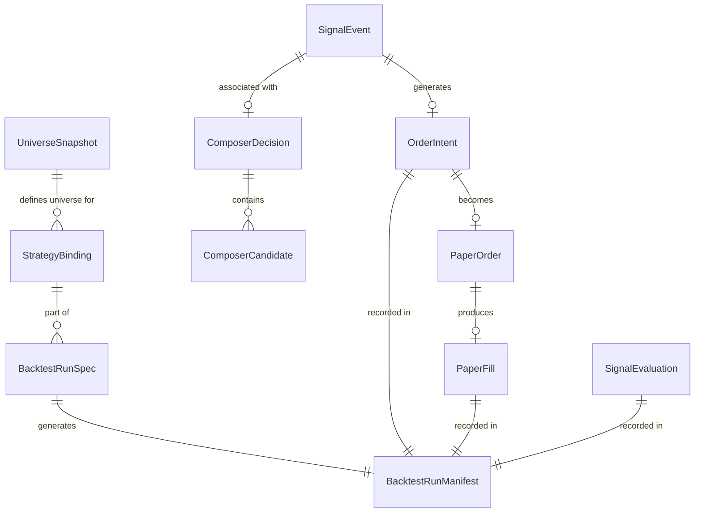

# 回测平台核心领域模型

## 文档信息

| 项目 | 内容 |
| --- | --- |
| 状态 | 建议方案 |
| 适用范围 | 回测与量化研究平台 Phase 1-7 实施 |
| 相关文档 | [当前状态审计](../reviews/backtest-current-state-audit.md)、[目标架构](./backtest-target-architecture.md) |
| 最后更新 | 2026-07-03 |

---

## 1. 模型总览

本文件定义回测平台新增的 6 个核心领域模型，按执行阶段排列：

| 模型 | 阶段 | 类型 | 说明 |
| --- | --- | --- | --- |
| `UniverseSnapshot` | 配置 | 不可变 | 股票池快照 |
| `StrategyBinding` | 配置 | 不可变 | 策略与股票池的绑定关系 |
| `BacktestRunSpec` | 配置 | 不可变 | 完整回测运行规格 |
| `ComposerDecision` | 执行中 | 不可变 | 多策略组合决策事实 |
| `OrderIntent` | 执行中 | 不可变 | 订单意向事实 |
| `BacktestRunManifest` | 完成后 | 不可变 | 运行元数据与产物清单 |

---

## 2. UniverseSnapshot

### 2.1 职责

表示某个 `effective_time` 和 `available_at` 下可见的股票池快照。防止回测使用未来才发布的指数成分或行业分类。

### 2.2 字段定义

```python
@dataclass(frozen=True, slots=True)
class UniverseSnapshot:
    # 标识
    universe_id: str                    # 唯一标识，如 "hs300_2025q2"
    universe_version: str                 # 版本，如 "v20250703"

    # 时间语义
    effective_time: datetime             # 该成分生效的市场时间
    available_at: datetime               # 该快照对系统可见的时间

    # 内容
    symbols: tuple[str, ...]             # 该快照包含的标的代码
    inclusion_reason: str                 # 如 "index_constituent"、"sector_classification"
    source: str                         # 如 "CSI"、"Wind"、"manual"
    source_version: str                  # 原始数据版本

    # 修订追踪
    revision_id: str                     # 修订编号
    as_of_version: str                   # as-of 版本标识
    replaced_by: str | None             # 若有更新版本，指向新 universe_version

    # 元数据
    created_at: datetime
    description: str = ""
```

### 2.3 版本键

`(universe_id, universe_version)` 唯一确定一份快照。

**幂等性**：相同 `(universe_id, effective_time, available_at, sorted(symbols))` 不得重复写入，后者抛 `DuplicateUniverseError`。

### 2.4 as-of 语义

给定 `decision_time`，只能使用满足 `available_at <= decision_time` 且 `effective_time <= decision_time` 的最新 `UniverseSnapshot`。

### 2.5 失败处理

- 成分变更事件生成新的 `UniverseSnapshot`，旧快照不修改
- 缺失 `available_at` 时拒绝写入，提示需要显式时间戳

---

## 3. StrategyBinding

### 3.1 职责

表示策略与股票池、参数、特征版本的绑定关系。同一个策略名称允许不同参数实例并行运行（通过不同 `binding_id`），不能通过伪造不同策略名称规避。

### 3.2 字段定义

```python
@dataclass(frozen=True, slots=True)
class StrategyBinding:
    # 标识
    binding_id: str                      # 唯一标识，如 "vol_breakout_hs300_v1"
    strategy_name: str                    # 策略名
    strategy_version: str                 # 策略版本
    parameter_hash: str                   # 参数哈希（来自 ParamSchema.compute_parameter_hash）

    # 绑定关系
    universe_id: str                      # 绑定的股票池 ID
    universe_version: str                  # 股票池版本

    # 版本
    feature_version: str                  # 特征版本
    composer_policy: str                  # 组合策略（如 "PRIORITY_MAX_CONFIDENCE"）
    market_rule_version: str | None       # 市场规则版本（None 表示默认）
    cost_model_version: str                # 成本模型版本
    fill_model_version: str               # 成交模型版本

    # 权重（用于 SCORE_WEIGHTED）
    weight: Decimal = Decimal("1.0")

    # 生效时间
    valid_from: datetime | None           # 绑定生效时间（None 表示从 start 开始）
    valid_to: datetime | None             # 绑定失效时间（None 表示无上限）

    # 元数据
    description: str = ""
    yaml_path: Path | None = None         # 来源配置路径
```

### 3.3 版本键

`(binding_id)` 唯一确定一个绑定。

### 3.4 约束

- `universe_id` 引用的 `UniverseSnapshot` 必须在 `available_at <= valid_from` 时已存在
- 相同 `strategy_name + strategy_version + parameter_hash` 不得在不同 `binding_id` 中重复绑定同一 `universe_id`（防止重复运行）
- `weight` 必须在 `[0, +inf)` 范围内（`SCORE_WEIGHTED` 策略下零权重表示静默跳过）

### 3.5 失败处理

- 配置校验失败 → `InvalidBindingError`，不启动运行
- `universe` 在 `valid_from` 时不可见 → `UniverseUnavailableError`

---

## 4. BacktestRunSpec

### 4.1 职责

描述一次完整、可复现的回测配置。必须支持从 YAML 或 JSON 加载，并生成冻结后的 resolved config。

### 4.2 字段定义

```python
@dataclass(frozen=True, slots=True)
class BacktestRunSpec:
    # 运行标识
    run_id: str                          # 运行时生成，SHA256(config + git_commit + timestamp)
    run_mode: str = "backtest"           # "backtest" | "replay" | "shadow"

    # 时间范围
    from_time: datetime                   # 起始市场时间（含）
    to_time: datetime                    # 终止市场时间（含）
    timeframe: str = "1m"               # K 线周期

    # 数据来源
    data_source_profile: DataSourceProfile # 行情数据源配置（已存在）
    data_source_version: str              # 数据源版本
    as_of_version: str                   # as-of 版本
    market_data_paths: tuple[str, ...]   # 本地数据文件路径（如有）

    # 策略绑定
    strategy_bindings: tuple[StrategyBinding, ...]  # 至少一个

    # 评价政策
    evaluation_policies: tuple[EvaluationPolicy, ...]  # 至少一个

    # 组合政策
    portfolio_policy: PortfolioPolicy       # 组合约束（仓位上限、单票上限等）
    initial_cash: Decimal = Decimal("1000000")  # 初始资金（元）
    cost_model_version: str               # 全局成本模型版本
    fill_model_version: str              # 全局成交模型版本

    # 市场规则
    market_rule_version: str | None      # None 表示使用默认 A 股规则

    # 时钟与确定性
    clock_policy: str = "frozen"         # "frozen" | "virtual"
    random_seed: int | None = None       # None 表示无随机

    # 存储与输出
    output_dir: Path                      # 产物输出目录
    store_signals: bool = True
    store_orders: bool = True
    store_fills: bool = True
    store_positions: bool = True
    store_evaluations: bool = True
    store_manifest: bool = True

    # 环境信息
    git_commit: str                       # 运行时快照
    python_version: str                   # Python 版本
    platform: str                         # OS

    # Resolved config（运行时生成）
    resolved_config_hash: str | None = None  # resolved 后配置哈希
    universe_snapshots: tuple[UniverseSnapshot, ...] = field(default_factory=tuple)
```

### 4.3 Resolved Config 流程

```
原始 YAML/JSON
    ↓
BacktestRunSpecLoader.load()
    ├─ 解析 strategy_bindings（展开 universe_id）
    ├─ 查询 UniverseRepository，获取对应 UniverseSnapshot
    ├─ 冻结所有版本（data_source_version, as_of_version, cost_model_version 等）
    ├─ 计算 resolved_config_hash = SHA256(sorted(json(resolved_spec).items()))
    └─ 返回 frozen BacktestRunSpec
```

### 4.4 验证规则

- `from_time < to_time`
- `timeframe` 必须是已知周期（`"1m"`, `"5m"`, `"15m"`, `"1d"`）
- `strategy_bindings` 至少一个
- `evaluation_policies` 至少一个
- `strategy_bindings` 中每个 `universe_id` 对应的 `UniverseSnapshot` 必须存在且 `available_at <= from_time`
- `output_dir` 必须可写

### 4.5 幂等性

相同 `run_id` 的重复运行必须幂等：`run_id` 基于 `(original_config_yaml + git_commit + timestamp)` 生成，`timestamp` 确保唯一性。

---

## 5. ComposerDecision

### 5.1 职责

多策略组合时，记录所有候选、使用的冲突策略、最终结果、被拒绝的候选及其拒绝原因。必须持久化，不得在函数内丢弃。

### 5.2 字段定义

```python
@dataclass(frozen=True, slots=True)
class ComposerDecision:
    # 标识
    decision_id: str                      # SHA256(binding_id + market_data_time + candidates_json)
    signal_event_id: str | None           # 若有胜者，对应 SignalEvent.signal_id
    binding_id: str                        # 所属 StrategyBinding
    symbol: str
    market_data_time: datetime

    # 候选信息
    candidates: tuple[ComposerCandidate, ...]  # 所有候选（含胜者和被拒者）

    # 决策结果
    policy: str                            # 冲突策略名称
    decision: str                         # 结果代码，如 "WINNER_SELECTED", "ABSTAIN"
    winner: ComposerCandidate | None        # 胜者（若 abstained 则 None）

    # 版本
    composer_version: str                  # 组合器代码版本
    decision_rule_version: str            # 决策规则版本

    # 时间
    decided_at: datetime                  # 决策时间（虚拟时间）
```

```python
@dataclass(frozen=True, slots=True)
class ComposerCandidate:
    # 来源
    strategy_name: str
    strategy_version: str
    parameter_hash: str
    runtime_name: str                     # StrategyRuntime 实例名

    # 信号属性
    direction: int                        # 1 Buy, 0 Hold, -1 Sell
    signal_action: str
    score: Decimal
    confidence: Decimal
    reason_codes: tuple[str, ...]

    # 决策
    is_winner: bool
    rejection_reason: str | None          # 若被拒，原因代码
    rejection_detail: str | None         # 若被拒，详细信息

    # 原始 SignalCandidate 引用
    candidate_snapshot: str                # JSON 序列化快照（用于审计）
```

### 5.3 持久化

`ComposerDecision` 作为 `SignalEvent` 的伴生事实，写入 `SignalRepository`（通过扩展接口或独立表）。

**幂等性**：相同 `(decision_id)` 重复写入必须幂等（`DuplicateDecisionError`）。

### 5.4 失败处理

- 组合器内部崩溃 → 记录 `ComposerDecision(decision="ERROR", candidates=())`，不中断回测
- 所有候选被拒 → `signal_event_id = None`，记录 `decision="ABSTAIN_ALL"`

---

## 6. OrderIntent

### 6.1 职责

在信号通过组合决策后、市场规则验证前，描述系统希望执行的交易意向。是信号层到执行层的桥梁。

### 6.2 与 `PaperOrder` 的区别

| 字段 | `OrderIntent` | `PaperOrder` |
| --- | --- | --- |
| 用途 | 信号层输出，执行层输入 | 执行层输出，账本层输入 |
| 是否可拒绝 | 是（通过 `OrderIntentStatus`） | 否（到达账本层即为成交） |
| 拒绝原因 | 由 `ExecutionEngine` 填充 | 无 |
| 时序 | 在市场规则验证之前 | 在市场规则验证之后 |

### 6.3 字段定义

```python
@dataclass(frozen=True, slots=True)
class OrderIntent:
    # 标识
    intent_id: str                        # SHA256(signal_id + fill_attempt)
    signal_id: str
    binding_id: str
    portfolio_id: str

    # 意向内容
    symbol: str
    side: str                             # "BUY" | "SELL"
    quantity: Decimal                     # 申请数量
    reference_price: Decimal              # 参考价格（信号时的 executable_price）

    # 时间和版本
    intent_time: datetime                  # 意向生成时间（虚拟时间）
    executable_time: datetime             # 最早可执行时间
    market_data_time: datetime            # 触发信号时的 bar 时间

    # 执行层填充
    status: str = "PENDING"             # "PENDING" | "ACCEPTED" | "REJECTED" | "CANCELLED"
    rejection_reason: str | None = None
    accepted_quantity: Decimal | None = None
    fill_price: Decimal | None = None
    fill_time: datetime | None = None
    fee: Decimal | None = None
    slippage: Decimal | None = None

    # 版本
    market_rule_version: str
    fill_model_version: str
    cost_model_version: str
```

### 6.4 幂等性

`OrderIntent` 不要求幂等：相同 `signal_id` 可能生成多个 `OrderIntent`（重试场景），但 `(intent_id)` 唯一。

### 6.5 状态机

```
PENDING
  ├─ ACCEPTED → 产生 PaperOrder + PaperFill
  ├─ REJECTED（涨跌停 / 停牌 / 资金不足 / T+1）
  └─ CANCELLED（系统取消，如后续相反信号覆盖）
```

---

## 7. BacktestRunManifest

### 7.1 职责

运行完成后必须保存的元数据、版本快照、警告和产物清单。是回测可复现性的核心保障。

### 7.2 字段定义

```python
@dataclass(frozen=True, slots=True)
class BacktestRunManifest:
    # 运行标识
    run_id: str
    run_mode: str                         # "backtest" | "replay" | "shadow"
    run_status: str                        # "success" | "failed" | "partial" | "cancelled"

    # 时间
    created_at: datetime                  # 运行开始时间（UTC）
    completed_at: datetime | None          # 运行结束时间（UTC）
    duration_seconds: float | None         # 总运行时间

    # 配置快照
    original_spec_yaml: str                # 原始 YAML（原文）
    resolved_spec_yaml: str                # resolved 后 YAML（含快照版本）
    resolved_config_hash: str              # resolved 配置哈希

    # 版本快照
    git_commit: str
    git_branch: str
    python_version: str
    platform: str

    strategy_versions: tuple[str, ...]     # 所有涉及策略版本
    feature_versions: tuple[str, ...]     # 所有涉及特征版本
    universe_versions: tuple[str, ...]    # 所有涉及股票池版本
    data_source_version: str
    as_of_version: str
    calendar_version: str
    evaluation_policy_versions: tuple[str, ...]
    cost_model_version: str
    fill_model_version: str
    market_rule_version: str
    engine_version: str                   # 回测引擎代码版本

    # 数据范围
    from_time: datetime
    to_time: datetime
    timeframe: str

    # 运行时统计
    total_bars_processed: int
    total_bars_skipped: int
    total_signals_generated: int
    total_signals_rejected: int
    total_order_intents: int
    total_orders_accepted: int
    total_orders_rejected: int
    total_fills: int
    total_evaluations_completed: int
    total_evaluations_postponed: int
    peak_memory_mb: float | None

    # 警告
    warnings: tuple[RunWarning, ...]      # 见 7.3

    # 数据质量
    missing_bar_count: int                # 预期但缺失的 bar 数
    duplicate_bar_count: int              # 重复 bar 数
    out_of_order_bar_count: int          # 乱序 bar 数
    quarantine_record_count: int          # 进入 quarantine 的记录数

    # 产物清单
    artifacts: tuple[ArtifactRef, ...]    # 见 7.4

    # 确定性校验
    deterministic_check_passed: bool
    deterministic_check_detail: str = ""

    # 断言
    expected_assertions: tuple[str, ...]  # 配置中声明的预期断言
    assertion_results: tuple[AssertionResult, ...]
```

### 7.3 RunWarning 类型

```python
@dataclass(frozen=True, slots=True)
class RunWarning:
    warning_code: str                     # 如 "MISSING_BARS", "UNIVERSE_CHANGE"
    severity: str                         # "info" | "warn" | "error"
    message: str
    affected_symbols: tuple[str, ...] = field(default_factory=tuple)
    affected_time_range: tuple[datetime, datetime] | None = None
    count: int = 1
```

### 7.4 ArtifactRef 类型

```python
@dataclass(frozen=True, slots=True)
class ArtifactRef:
    artifact_name: str                      # 如 "signals.parquet"
    artifact_path: str                     # 相对 output_dir 的路径
    artifact_type: str                     # "parquet" | "json" | "csv" | "md"
    record_count: int | None               # 记录数（若可计数）
    checksum_sha256: str                   # 文件校验和
    created_at: datetime
```

### 7.5 存储

`manifest.json` 存储于 `output_dir/` 根目录，与所有产物文件同级。manifest 本身是产物之一，因此不在自身 `artifacts` 中自引用。

---

## 8. 模型关系图



---

## 9. 不可变性保证

所有 6 个核心模型均采用 `frozen=True, slots=True`：

- `UniverseSnapshot`：成分变更不修改旧快照，生成新版本
- `StrategyBinding`：参数变更不修改旧绑定，生成新 `binding_id`
- `BacktestRunSpec`：运行后不修改配置快照
- `ComposerDecision`：决策一旦做出不可撤销
- `OrderIntent`：订单意向不修改状态，替换通过新 intent_id
- `BacktestRunManifest`：运行元数据只追加，不覆盖

---

## 10. 幂等键汇总

| 模型 | 幂等键 | 冲突行为 |
| --- | --- | --- |
| `UniverseSnapshot` | `(universe_id, universe_version)` | `DuplicateUniverseError` |
| `StrategyBinding` | `binding_id` | `DuplicateBindingError` |
| `BacktestRunSpec` | `run_id` | `DuplicateRunError`（或幂等跳过） |
| `ComposerDecision` | `decision_id` | `DuplicateDecisionError` |
| `OrderIntent` | `intent_id` | `DuplicateIntentError`（允许重试幂等） |
| `BacktestRunManifest` | `run_id` | 覆盖（Manifest 允许同一 run_id 重写） |

---

## 11. 状态标注来源

| 模型 | 标注来源 |
| --- | --- |
| `UniverseSnapshot` | 建议方案（Phase 1 实现） |
| `StrategyBinding` | 建议方案（Phase 1 实现） |
| `BacktestRunSpec` | 建议方案（Phase 1 实现） |
| `ComposerDecision` | 建议方案（Phase 3 实现） |
| `OrderIntent` | 建议方案（Phase 4 实现） |
| `BacktestRunManifest` | 建议方案（Phase 1 实现） |
