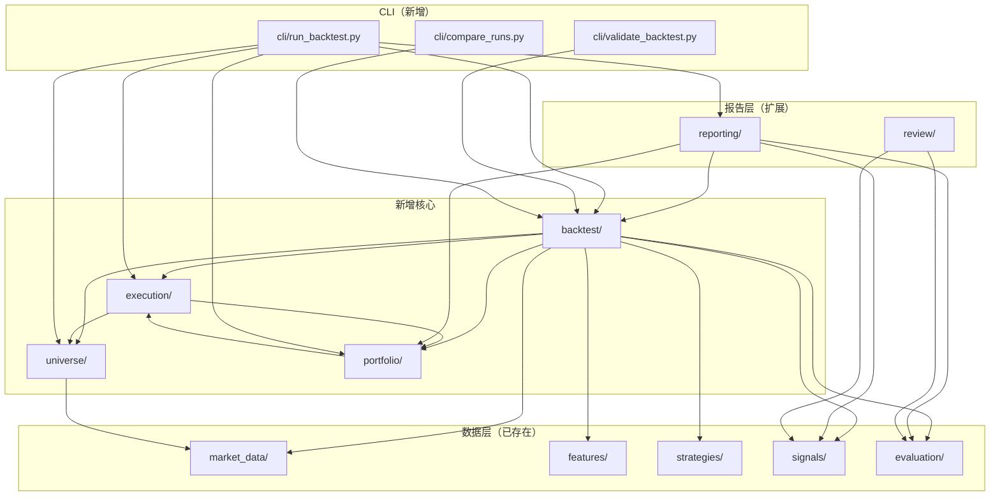
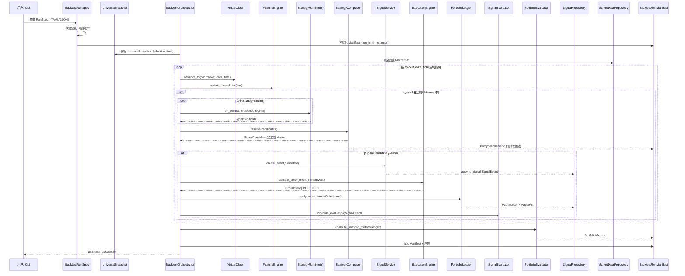
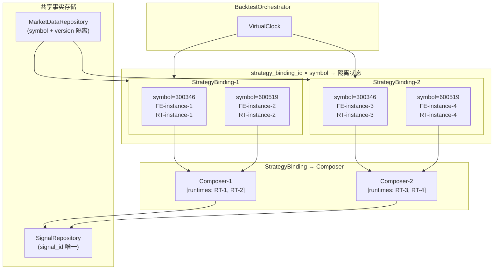

# 回测平台目标架构

## 文档信息

| 项目 | 内容 |
| --- | --- |
| 状态 | 建议方案 |
| 适用范围 | 短线量化交易建议系统回测与量化研究平台 |
| 相关文档 | [开发指导](./development-guide.md)、[当前状态审计](../reviews/backtest-current-state-audit.md) |
| 最后更新 | 2026-07-03 |

---

## 1. 设计原则

### 1.1 已确定原则

1. **事实层和派生层分离**：事实层（`MarketBar`、`SignalEvent`、`ComposerDecision`、`OrderIntent`、`PaperFill`、`PositionSnapshot`、`SignalEvaluation`）不可变，报告从事实派生，不得由 `BacktestRunner` 直接拼接。
2. **Signal Evaluation 和 Portfolio Backtest 分层**：Signal Evaluation 回答方向预测能力；Portfolio Backtest 回答可执行性、资金充足性、T+1、整数手、涨跌停等约束下的结果。两层使用不同的输出模型，不混合。
3. **实时和回测复用核心**：`FeatureEngine`、`StrategyRuntime`、`StrategyComposer`、评价逻辑、持仓账本必须共用，不得分叉。
4. **确定性执行**：相同输入（数据、版本、参数、时钟、随机种子）必须产生完全一致的事实序列。
5. **`SignalEvent` append-only**：历史信号不修改，修正通过版本实现。
6. **版本化**：每次运行冻结并记录所有核心版本，不得混合不同版本结果。

### 1.2 建议方案原则

1. **模块化单体**：保留清晰接口边界，只有明确存在独立部署、故障隔离或资源隔离需求时才提出拆分服务。
2. **不重复建设**：已实现的模块（`contracts/`、`features/`、`strategies/`、`evaluation/` 等）必须复用，不得重写。
3. **属性测试引入需 ADR**：引入新依赖（如 `hypothesis`）必须先记录 ADR。

---

## 2. 架构原则详解

### 2.1 事实层和派生层分离

```
事实事件（append-only，不可变）
    │
    ├── MarketBar ──── MarketDataRepository
    ├── FeatureSnapshot ── FeatureEngine
    ├── SignalCandidate ── StrategyRuntime
    ├── SignalEvent ──── SignalService
    ├── ComposerDecision ── StrategyComposer
    ├── OrderIntent ──── BacktestOrchestrator
    ├── PaperOrder ──── PaperPortfolio
    ├── PaperFill ────── PaperPortfolio
    ├── PositionSnapshot ─ PaperPortfolio
    └── SignalEvaluation ─ SignalEvaluator
              │
              ▼
         持久化（SQLite/内存）
              │
              ▼
         报告派生（Reporting Layer）
              │
              ├── SignalMetrics（按 strategy × symbol × direction 分桶）
              ├── PortfolioMetrics（资金曲线、回撤、换手）
              └── BacktestRunManifest（配置快照、版本、警告）
```

**已确定**：报告必须由事实数据派生，`BacktestRunner` 只负责驱动事件链和写入事实，不负责报告拼接。

### 2.2 Signal Evaluation 和 Portfolio Backtest 分层

| 维度 | Signal Evaluation | Portfolio Backtest |
| --- | --- | --- |
| 回答问题 | 信号是否具有方向预测能力 | 信号转换为组合后是否可执行 |
| 输入 | `SignalEvent` + `MarketBar` 路径 | `SignalEvent` + `OrderIntent` + 市场规则 |
| 依赖 | 信号事实 + 行情路径 | 订单模型 + 市场规则引擎 + 成本模型 + 持仓账本 |
| 核心指标 | 命中率、MFE/MAE、三重障碍、置信度校准 | 总收益、年化、夏普、最大回撤、换手率、交易成本 |
| 可执行性 | 不考虑 | 必须考虑 T+1、涨跌停、停牌、资金 |
| 输出模型 | `SignalEvaluation`（已存在） | `PortfolioMetrics`（新增） |
| 禁止 | 不得混合组合层收益 | 不得把信号层收益当作组合层收益 |

### 2.3 确定性要求

相同以下要素必须产生完全一致的结果：

- 输入 `MarketBar` 序列及其版本
- 策略版本、参数哈希、特征版本
- 时钟（`FrozenClock`）
- 随机种子（若使用）
- 交易规则版本、市场规则版本
- 成本模型版本、成交模型版本
- 事件排序规则（稳定排序键）

**禁止**：

- 系统当前时间
- 非固定随机源
- 未排序的 `set` / `dict`
- 不稳定线程调度
- 隐式全局状态

### 2.4 时间语义显式化

所有核心对象必须明确区分以下时间字段：

| 时间字段 | 状态 | 定义 | 禁止用途 |
| --- | --- | --- | --- |
| `market_data_time` | 已确定 | 行情数据代表的市场时间 | 当成系统接收时间 |
| `bar_end_time` | 已确定 | Bar 覆盖时间窗口的结束 | 用于交易决策 |
| `available_at` | 已确定 | 数据对系统现实可获得的时间 | 用于信号生成 |
| `ingest_time` | 已确定 | 系统接收到数据的时间 | 用于评价价格 |
| `event_time` | 已确定 | 策略产生信号的系统时间 | 早于 bar_end_time |
| `executable_time` | 已确定 | 信号最早可模拟执行的时间 | 等同于 bar 内最高/最低价 |
| `fill_time` | 已确定 | 模拟成交时间 | 早于 executable_time |
| `evaluation_time` | 已确定 | 评价执行时间 | 使用评价窗口前不可得的价格 |

**已确定**：Bar 的时间标签是 `bar_end_time`（分钟级 `market_data_time` 等同于 `bar_end_time`）。Bar 在 `bar_end_time` 后才对策略可见。午间休市、停牌、临时停牌由 `TradingCalendar` 定义。

---

## 3. 目标模块划分

### 3.1 模块总览

```
src/quant_signal_system/
  contracts/           # 已存在：MarketBar, SignalEvent, SignalEvaluation 等（不变）
  time/               # 已存在：Clock, TradingCalendar（扩展）
  market_data/        # 已存在：Repository, ReplaySource（扩展）
  features/           # 已存在：RollingFeatureEngine（扩展）
  strategies/         # 已存在：StrategyRuntime, Composer（扩展）
  signals/           # 已存在：Service, Repository（扩展）
  evaluation/         # 已存在：Evaluator, Scheduler（扩展）

  # ── 新增模块 ──
  backtest/           # 目标：RunSpec, Manifest, Orchestrator, StatePartition
  universe/           # 目标：UniverseSnapshot, UniverseRepository, Resolver
  execution/          # 目标：MarketRulesEngine, OrderModel, FillModel, CostModel
  portfolio/          # 目标：Ledger, Settlement, Position, Cash, Policy
  cli/                # 目标：run_backtest, validate_backtest, compare_runs

  reporting/         # 已存在：扩展为多维聚合和报告生成
  review/             # 目标：validation_checks（事实校验）
```

### 3.2 新增模块职责

#### `backtest/` 模块

| 文件 | 状态 | 职责 | 非职责 |
| --- | --- | --- | --- |
| `run_spec.py` | 新增 | 描述一次完整可复现回测的配置快照 | 不执行回测，不生成报告 |
| `manifest.py` | 新增 | 运行完成后保存的元数据、版本、警告、产物列表 | 不修改事实 |
| `orchestrator.py` | 新增 | 驱动整个回测执行流程：加载→排序→Feature→策略→Composer→持久化→评价→组合 | 不计算指标 |
| `scheduler.py` | 新增 | 虚拟时钟推进、事件排序、bar 闭合检测 | 不访问系统时钟 |
| `state_partition.py` | 新增 | 每个 (strategy_binding_id, symbol) 的隔离状态管理 | 不跨 binding 共享 |
| `result.py` | 新增 | 回测运行结果（包含所有事实 ID 和汇总统计） | 不生成报告 |

**幂等键**：`run_id = SHA256(original_config_yaml + git_commit + timestamp)`（确定性）。

**依赖**：`market_data/`、`features/`、`strategies/`、`signals/`、`evaluation/`、`portfolio/`、`universe/`、`execution/`。

**失败模式**：

- 配置校验失败 → fail fast，不启动
- 数据缺失 → 写入警告，继续处理可得的 bar
- 存储写入失败 → 事务回滚，标记 run 失败

#### `universe/` 模块

| 文件 | 状态 | 职责 | 非职责 |
| --- | --- | --- | --- |
| `contracts.py` | 新增 | `UniverseSnapshot` 契约 | 不接入外部数据源 |
| `repository.py` | 新增 | Universe 快照的版本化存储和查询 | 不决定成分来源 |
| `resolver.py` | 新增 | 给定时间和 symbol，返回可见的 UniverseSnapshot | 不修改 Universe |

**幂等键**：`universe_version = SHA256(universe_id + effective_time + available_at + sorted(symbols))`。

**依赖**：`contracts/`、`time/`、`config/`。

#### `execution/` 模块

| 文件 | 状态 | 职责 | 非职责 |
| --- | --- | --- | --- |
| `market_rules.py` | 新增 | A 股市场规则引擎（T+1、涨跌停、停牌、整数手） | 不生成信号 |
| `order_model.py` | 新增 | 订单验证（资金、仓位、涨跌停阻断） | 不执行真实下单 |
| `fill_model.py` | 新增 | 扩展现有 FillModel，支持涨跌停等可执行性 | 不做基本面分析 |
| `cost_model.py` | 新增 | 扩展现有 CostModel | 不做基本面分析 |

**依赖**：`contracts/`、`universe/`、`time/`、`portfolio/`。

#### `portfolio/` 模块（扩展现有 `paper/`）

| 文件 | 状态 | 职责 | 非职责 |
| --- | --- | --- | --- |
| `ledger.py` | 新增 | 资金账本（现金、资产、负债、守恒校验） | 不做基本面分析 |
| `position.py` | 新增 | 持仓快照（成本均价、盈亏、可用数量） | 不做基本面分析 |
| `cash.py` | 新增 | 现金余额管理 | 不做基本面分析 |
| `settlement.py` | 新增 | T+1 结算、持仓可用性计算 | 不做基本面分析 |
| `policy.py` | 新增 | 组合策略（最大仓位、单票上限等） | 不生成信号 |
| `paper.py` | 扩展 | 保留现有 `PaperPortfolio` 接口，扩展 T+1 和资金约束 | 不绕过信号层 |

**幂等键**：`position_key = (portfolio_id, symbol, as_of_time)`。

**依赖**：`execution/`、`contracts/`、`time/`。

#### `reporting/` 模块（扩展）

| 文件 | 状态 | 职责 | 非职责 |
| --- | --- | --- | --- |
| `report_builder.py` | 扩展 | 扩展为多维分桶聚合，支持 strategy × symbol × direction 等维度 | 不修改事实 |
| `dimensions.py` | 新增 | 分桶维度定义和聚合逻辑 | 不生成信号 |
| `tables.py` | 新增 | 表格格式化（Markdown / CSV / JSON） | 不生成信号 |
| `artifacts.py` | 新增 | 产物清单管理（parquet/json/csv 输出） | 不修改事实 |

**幂等键**：`report_run_id`（由 `BacktestRunManifest.report_run_id` 派生）。

**依赖**：`signals/`、`evaluation/`、`portfolio/`、`backtest/`。

#### `cli/` 模块

| 文件 | 状态 | 职责 | 非职责 |
| --- | --- | --- | --- |
| `run_backtest.py` | 新增 | 主回测入口：加载 RunSpec → 执行 → 写 Manifest → 生成报告 | 不修改源代码 |
| `validate_backtest.py` | 新增 | 验证 BacktestRunManifest 完整性和确定性 | 不执行回测 |
| `compare_runs.py` | 新增 | 比较两次运行的结果差异 | 不执行回测 |

**入口点**：`python -m quant_signal_system.cli.run_backtest --spec config.yaml`。

### 3.3 模块依赖图



---

## 4. 关键流程

### 4.1 回测执行时序



### 4.2 事件稳定排序规则

同一 `market_data_time` 的事件按以下固定顺序处理：

1. Corporate Action（分红、拆股）
2. Trading Status（停牌恢复、临时停牌）
3. Market Bar Close（行情闭合）
4. Feature Update（特征计算）
5. Strategy Candidate（各策略独立生成）
6. Composer Decision（组合决策）
7. Signal Event（信号持久化）
8. Order Intent（订单意向生成）
9. Execution Validation（市场规则验证）
10. Portfolio Update（持仓账本更新）
11. Evaluation Task（评价任务调度）
12. Portfolio Snapshot（组合快照）

### 4.3 多策略多股票状态隔离



**关键约束**：每个 `(strategy_binding_id, symbol)` 组合拥有独立的 `FeatureEngine` 实例和 `StrategyRuntime` 实例。不同 `StrategyBinding` 之间共享 `MarketDataRepository`（已通过 symbol 隔离）。

---

## 5. 架构决策记录（ADR）

### ADR-BT-001：多 Symbol FeatureEngine 隔离方案

**状态**：建议方案

**背景**：`RollingFeatureEngine` 当前以 `_bars_by_symbol: dict[str, list[MarketBar]]` 按 symbol 隔离状态，但单实例跨多 symbol 调用时，各自 symbol 槽位内的滚动窗口是独立的。

**决策**：在 `BacktestOrchestrator` 中，按 `(strategy_binding_id, symbol)` 创建独立的 `FeatureEngine` 实例映射。

**影响**：

- 优点：完全隔离，无状态污染
- 缺点：N 个 binding × M 个 symbol = N×M 个实例；大规模场景可能有内存压力

**替代方案**：复用单实例 + keyed state（当前评估为过早优化，Phase 7 Benchmark 后决定）。

### ADR-BT-002：Backtest 结果存储格式

**状态**：待决策

**选项**：

- A. JSON Lines（`results.jsonl`）：人类可读，便于调试
- B. Parquet（`results.parquet`）：列式存储，压缩率高，适合大数据量
- C. SQLite（`results.db`）：与现有 `SQLiteMarketDataRepository` 一致

**建议方案**：A + C 并行。JSON Lines 用于 `manifest.json`，SQLite 用于 `signals.parquet`（通过 SQLite 导出为 Parquet）。理由：减少新增依赖（Parquet 需要 `pyarrow`），现有 SQLite 基础设施已可用。

### ADR-BT-003：ComposerDecision 持久化时机

**状态**：建议方案

**决策**：在 `ComposerDecision` 产生后立即持久化到 `SignalRepository`（作为 `SignalEvent` 的伴生事实）。

**理由**：多策略归因需要完整记录所有候选及其被拒原因，不应在报告层事后重建。

---

## 6. 与现有架构的关系

### 6.1 复用已存在模块

| 现有模块 | 复用方式 | 不改变 |
| --- | --- | --- |
| `contracts/` | 所有新契约继承现有不可变数据类模式 | 字段定义 |
| `features/engine.py` | `RollingFeatureEngine` 扩展为按 `(binding, symbol)` 实例化 | 计算逻辑 |
| `strategies/` | `StrategyRuntime`、`StrategyComposer` 完全复用 | 核心接口 |
| `signals/service.py` | `SignalService` 完全复用 | 校验逻辑 |
| `signals/repository.py` | `InMemorySignalRepository` 复用；扩展 `SQLiteSignalRepository` | 基础接口 |
| `evaluation/evaluator.py` | `SignalEvaluator` 完全复用 | 指标计算 |
| `evaluation/cost_model.py` | `FixedBpsCostModel` 复用，扩展为 `AshareCostModel` | 接口契约 |
| `evaluation/fill_model.py` | 扩展 `NextBarOpenFillModel` 支持涨跌停 | 接口契约 |
| `portfolio/paper.py` | 扩展为 `PortfolioLedger`，保留接口兼容性 | 基本状态机 |
| `time/clock.py` | `FrozenClock` 复用，新增 `VirtualClock` | 时钟协议 |
| `time/trading_calendar.py` | `SimpleAshareTradingCalendar` 复用 | A 股规则 |
| `market_data/repository.py` | 两者复用 | 版本化存储 |
| `config/versions.py` | `VersionRegistry` 复用（需先修复无锁问题） | 冻结接口 |

### 6.2 扩展点

| 现有模块 | 扩展点 | 扩展方式 |
| --- | --- | --- |
| `portfolio/paper.py` | T+1、资金约束 | 替换为 `PortfolioLedger`（兼容接口） |
| `reporting/reports.py` | 多维分桶报告 | 替换为新 `report_builder.py`（保留文件名） |
| `evaluation/evaluator.py` | 组合层评价 | 新增 `PortfolioEvaluator`（不修改现有） |

### 6.3 不重写的决策

以下模块**不会因 Phase 1-7 重写**：

- `contracts/market.py` — `MarketBar` 契约已完整
- `features/engine.py` — 滚动特征计算已正确
- `strategies/protocol.py` — `StrategyRuntime` Protocol 已完整
- `signals/service.py` — `SignalService` 逻辑已正确
- `evaluation/evaluator.py` — 核心指标计算已正确
- `time/clock.py` — `Clock` 抽象已完整

---

## 7. 量化正确性约束

### 7.1 前视偏差防护

| 检查点 | 状态 | 实现位置 |
| --- | --- | --- |
| `bar.validate(require_closed=True)` | ✅ 已有 | `RuleStrategyRuntime.on_bar` |
| `event_time >= bar_end_time` | ✅ 已有 | `SignalService` |
| `executable_time > event_time` | ✅ 已有 | `SignalService` |
| 特征输入不超过 `market_data_time` | ⚠️ 待验证 | `RollingFeatureEngine` |
| Universe 不使用 `available_at > event_time` | ❌ 缺失 | `UniverseResolver` |
| 复权因子不引入未来修订 | ❌ 缺失 | 依赖数据源版本 |

### 7.2 数据泄漏防护

| 检查点 | 状态 | 实现位置 |
| --- | --- | --- |
| `AsOfDataset.validate_visible_at()` | ✅ 已有 | `contracts/reference_data.py` |
| `FeatureSnapshot.input_bar_range` | ✅ 已有 | `features/engine.py` |
| 标准化使用同一 `data_source_version` | ⚠️ 待验证 | Repository 层 |
| 行业/板块成分使用 as-of | ❌ 缺失 | `UniverseResolver` |

### 7.3 其他约束

| 约束 | 状态 | 说明 |
| --- | --- | --- |
| Sell 不做空 | ✅ 已有 | `PaperPortfolio` 不允许负仓 |
| 不可执行样本纳入分母 | ⚠️ 已有字段，待报告层实现 | `execution_status` 字段已存在 |
| 成本模型必填 | ✅ 已有 | `cost_model_version` 字段 |
| 不同版本不得混合 | ⚠️ 待实现 | Manifest 层控制 |
