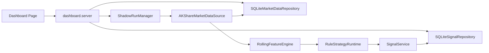

# Dashboard/API 页面系统设计

## 1. 状态与边界

已确定：`Dashboard/API` 是本地研究页面系统，用于展示版本化 `MarketBar`、`SignalEvent`、`SignalEvaluation` 和本地 `ShadowRun` 状态。

已确定：页面系统不连接真实券商账户，不自动执行真实交易，不修改历史 `SignalEvent`，不把回测或影子运行结果描述为收益承诺。

建议方案：第一版使用 Python 标准库 HTTP 服务和仓库内 vendored `ECharts` 静态资产，避免新增后端运行依赖。长期是否拆成独立服务、是否引入鉴权和前端构建系统仍为待决策。

## 2. 模块职责

| 模块 | 状态 | 职责 | 输入 | 输出 | 依赖 | 失败处理 |
| --- | --- | --- | --- | --- | --- | --- |
| `dashboard.server` | 已确定 | 提供本地 HTTP 页面和 JSON API | 查询参数、shadow run 控制请求 | HTML、静态资产、DTO JSON | `SQLiteMarketDataRepository`、`SQLiteSignalRepository` | 参数错误返回结构化 JSON；静态路径限制在 `static` 目录 |
| `dashboard.dto` | 已确定 | 将领域对象投影为页面 DTO | `MarketBar`、`SignalEvent`、`SignalEvaluation` | `DashboardBar`、`DashboardSignalPoint`、`DashboardEvaluationSummary` | `contracts` | 保留版本字段；`SELL` 明确展示为风险规避/减仓/清仓语义 |
| `dashboard.shadow` | 建议方案 | 启动、停止、查询本地研究 shadow run | 标的、时间窗、周期 | 本地 shadow run 状态、持久化研究信号 | `AKShareMarketDataSource`、`FeatureEngine`、`StrategyRuntime`、`SignalService` | 数据源缺失或采集失败时记录 `FAILED` 和 `last_error`，不写入半成品真实交易状态 |
| `signals.sqlite_repository` | 已确定 | 持久化信号、评价任务和评价结果 | `SignalEvent`、`EvaluationTask`、`SignalEvaluation` | 可查询的 append-only 事实和评价结果 | SQLite、`contracts` | 重复写幂等；同 `signal_id` 内容冲突时报错 |

## 3. 数据流

已确定：页面读取的是持久化事实和派生评价；shadow run 复用现有行情、特征、策略和信号服务链路。

## 4. API 契约

建议方案：第一版 API 仅绑定 `127.0.0.1` 本地研究使用。

| API | 方法 | 说明 |
| --- | --- | --- |
| `/api/health` | `GET` | 返回研究用途状态，`real_trading=false` |
| `/api/bars` | `GET` | 按 `symbol`、时间窗、`timeframe`、`data_source_version`、`as_of_version` 查询 K 线 |
| `/api/signals` | `GET` | 按标的、时间窗、策略版本和方向查询 BS 点 |
| `/api/evaluations` | `GET` | 按 `signal_id` 或信号筛选条件查询评价摘要 |
| `/api/strategies` | `GET` | 返回已持久化策略版本及样本数 |
| `/api/shadow-runs` | `GET` / `POST` | 查询或启动本地 shadow run |
| `/api/shadow-runs/{run_id}/stop` | `POST` | 请求停止本地 shadow run |

## 5. 待决策

- 待决策：是否把 `Dashboard/API` 从本地标准库服务升级为独立 Web 服务。
- 待决策：是否引入用户登录、访问控制和审计日志。
- 待决策：shadow run 是否需要持久化任务表、租约和恢复机制。
- 待决策：是否支持多策略组合信号；第一版只展示多 `strategy_version` 对比，不计算组合投票。
