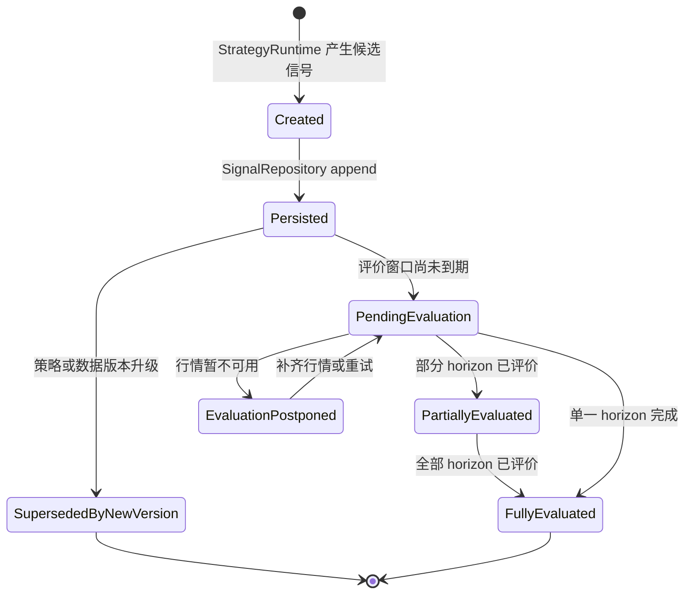

# 核心领域模型与数据契约

相关文档：[开发指导](./development-guide.md)、[模块设计](./module-design.md)、[测试与评价](./testing-and-evaluation.md)、[术语表](../glossary.md)、[开放问题](../decisions/open-questions.md)

## 1. 数据契约原则

- 已确定：所有价格评价必须基于信号产生后现实可获得的价格。
- 已确定：禁止使用未来数据、未来修订数据或信号时刻尚未闭合的 K 线。
- 已确定：`SignalEvent` append-only，不允许修改历史信号。
- 已确定：实时和回放应使用相同的数据契约。
- 已确定：行情、特征、评价和模拟持仓必须携带足以复现的版本键。
- 建议方案：所有契约包含 `schema_version`，关键事实包含版本、来源和生成时间。
- 待决策：具体数据库、字段类型精度、数据保留周期和供应商字段映射。

## 2. 时间语义

| 字段 | 状态 | 定义 | 常见错误 |
| --- | --- | --- | --- |
| `market_data_time` | 已确定 | 行情数据代表的市场时间，例如 Bar 结束时间或 Tick 发生时间 | 当成系统接收时间使用 |
| `ingest_time` | 已确定 | 系统接收到数据的时间 | 用于交易价格评价 |
| `event_time` | 已确定 | 策略完成计算并产生信号的系统时间 | 早于所用行情闭合时间 |
| `executable_time` | 已确定 | 信号在现实中最早可模拟执行的时间 | 等同于信号 Bar 内最高/最低价 |
| `evaluation_time` | 已确定 | 某个评价窗口实际评价的时间 | 使用评价窗口之前不可获得的价格 |

建议方案：所有时间字段使用带时区语义的 UTC 存储，并在展示层转换为市场本地时区。A 股交易时段、午休、停牌和半日市需由交易日历定义，具体来源待决策。

已确定：对分钟级 `MarketBar`，`market_data_time` 等同于 `bar_end_time`。如果实现同时保存 `bar_start_time` 和 `bar_end_time`，去重、排序和策略输入统一以 `bar_end_time` 为准。字段名 `bar_time` 不作为正式契约字段使用。

## 3. 价格语义

| 字段 | 状态 | 定义 | 用途 |
| --- | --- | --- | --- |
| `reference_price` | 已确定 | 信号生成时策略可观察到的参考价格 | 解释信号和展示 |
| `executable_price` | 已确定 | `executable_time` 后按成交模型得到的可执行价格 | 计算方向标签收益、净收益和模拟成交 |
| `evaluation_price` | 已确定 | 评价窗口到达后现实可获得的价格 | 固定窗口评价 |

已确定：不得用信号所在未闭合 K 线的未来最高价、最低价或收盘价作为执行或评价价格。

## 4. 领域模型

| 对象 | 状态 | 是否不可变 | ID 规则建议 | 所属模块 | 说明 |
| --- | --- | --- | --- | --- | --- |
| `MarketTick` | 建议方案 | 是 | `(source, symbol, market_data_time, source_sequence, data_source_version)` | Market Data Normalizer | 标准化逐笔或盘口事件 |
| `MarketBar` | 已确定 | 是 | `(symbol, timeframe, market_data_time, data_source_version, as_of_version)` | Bar Aggregator | 已闭合 OHLCV Bar |
| `FeatureSnapshot` | 已确定 | 是 | `feature_snapshot_id` 或内容哈希 | Feature Engine | 信号时点可见特征 |
| `MarketRegime` | 建议方案 | 是 | `(symbol, market_data_time, regime_version)` | Market Regime Engine | 市场状态标签 |
| `SignalEvent` | 已确定 | 是且 append-only | `signal_id` 或事件内容哈希 | Signal Service | 信号事实源 |
| `EvaluationTask` | 建议方案 | 可派生或持久化 | `(signal_id, horizon_seconds)` | Evaluation Scheduler | 到期评价任务 |
| `SignalEvaluation` | 已确定 | 结果不可变，写入幂等 | `(signal_id, horizon_seconds, evaluator_version)` | Signal Evaluator | 信号评价事实 |
| `StrategyVersion` | 已确定 | 是 | `(strategy_name, strategy_version, parameter_hash)` | Configuration and Version Management | 策略和参数版本 |
| `PaperOrder` | 建议方案 | 是 | `paper_order_id` | Paper Portfolio | 模拟订单 |
| `PaperFill` | 建议方案 | 是 | `paper_fill_id` | Paper Portfolio | 模拟成交 |
| `PaperPosition` | 建议方案 | 可由事件重建 | `(portfolio_id, symbol, as_of_time)` | Paper Portfolio | 模拟持仓状态 |

## 5. 契约字段

### 5.1 `MarketTick`

```text
MarketTick
  schema_version: string
  symbol: string
  market_data_time: datetime
  ingest_time: datetime
  source: string
  source_sequence: string | null
  last_price: decimal | null
  bid_price: decimal | null
  ask_price: decimal | null
  bid_size: decimal | null
  ask_size: decimal | null
  trade_price: decimal | null
  trade_volume: decimal | null
  trading_status: string
  data_source_version: string
  source_revision: string | null
```

建议方案：供应商特有字段进入扩展区，不进入策略核心。`source_sequence` 不存在时，去重键必须退化为 `(source, symbol, market_data_time, price, volume, data_source_version)` 等可解释组合，并在接入文档中说明。

### 5.2 `MarketBar`

```text
MarketBar
  schema_version: string
  symbol: string
  timeframe: string
  bar_start_time: datetime
  bar_end_time: datetime
  market_data_time: datetime
  ingest_time: datetime
  open_price: decimal
  high_price: decimal
  low_price: decimal
  close_price: decimal
  volume: decimal | null
  amount: decimal | null
  turnover: decimal | null
  trading_status: string
  is_closed: boolean
  bar_close_time: datetime
  source: string
  data_source_version: string
  as_of_version: string
  source_revision: string | null
```

已确定：只有 `is_closed = true` 的 `ClosedMarketBar` 可以进入 `FeatureEngine`。`event_time >= bar_end_time`，`executable_time > event_time`。迟到 Tick 或供应商修订不得覆盖旧 Bar；应生成新的 `data_source_version` / `as_of_version`，或进入 quarantine 后由人工/批处理决定是否生成新版本。

### 5.3 `FeatureSnapshot`

```text
FeatureSnapshot
  schema_version: string
  feature_snapshot_id: string
  symbol: string
  market_data_time: datetime
  generated_at: datetime
  feature_version: string
  lookback_window: string
  features: map<string, number | string | null>
  missing_data_flags: list<string>
  input_bar_range: string
```

建议方案：`FeatureSnapshot` 可以嵌入 `SignalEvent`，也可以单独存储后由 `feature_snapshot_id` 引用。第一版为便于复现，可在 `SignalEvent` 中保存关键特征快照。

### 5.4 `MarketRegime`

```text
MarketRegime
  schema_version: string
  symbol: string
  market_data_time: datetime
  generated_at: datetime
  regime_version: string
  regime_label: string
  confidence: decimal | null
  inputs: map<string, string>
  as_of_version: string
  unavailable_inputs: list<string>
```

已确定：`MarketRegime` 使用的指数、板块、行业成分、复权因子和其他外部研究数据，必须携带 `as_of_time`、`effective_time`、`available_at`、`revision_id` 或等价字段。不得使用信号时点尚不可见的行业/板块、指数成分或复权数据。

### 5.5 `SignalEvent`

```text
SignalEvent
  schema_version: string
  signal_id: string
  symbol: string
  direction: int              # 1 Buy, 0 Hold, -1 Sell
  signal_action: BUY | REDUCE_LONG | CLEAR_LONG | RISK_AVOID | HOLD
  exposure_effect: INCREASE_LONG | DECREASE_LONG | FLAT | NO_ACTION
  event_time: datetime
  market_data_time: datetime
  ingest_time: datetime
  executable_time: datetime
  reference_price: decimal
  executable_price: decimal | null
  executable_price_source: string | null
  execution_status: EXECUTABLE | UNEXECUTABLE | UNKNOWN_AT_EVENT_TIME
  unexecutable_reason: string | null
  score: decimal
  confidence: decimal
  horizon_seconds: int
  reason_codes: list<string>
  invalid_condition: string | null
  feature_snapshot: FeatureSnapshot
  market_regime: MarketRegime | null
  strategy_name: string
  strategy_version: string
  feature_version: string
  code_version: string
  parameter_hash: string
  data_source_version: string
  as_of_version: string
  created_at: datetime
```

已确定：`SignalEvent` 不允许更新。若发现错误，应记录新的策略版本、数据版本或评价说明，不修改原信号。

已确定：`executable_price` 只有在 `event_time` 当下已经现实可见时才允许填充。若执行价格必须等待后续行情确认，`SignalEvent` 只记录 `executable_time`、`execution_status = UNKNOWN_AT_EVENT_TIME` 和执行定价规则；实际价格写入 `SignalEvaluation`、`PaperFill` 或独立执行假设记录。

已确定：`direction = -1` 只表示信号方向标签，不等同于真实做空收益。A 股默认 `signal_action` 为 `REDUCE_LONG`、`CLEAR_LONG` 或 `RISK_AVOID`，`PaperPortfolio` 不允许因此产生负持仓。

已确定：不可执行样本不得静默剔除。涨跌停、停牌、成交量不足或价格不可得时，必须记录 `execution_status` 和 `unexecutable_reason`，并在报告中展示数量和占比。

### 5.5.1 `SignalEvent` 派生视图生命周期



已确定：上图是由 `SignalEvent`、`EvaluationTask` 和 `SignalEvaluation` 共同计算出的派生视图，不是写回 `SignalEvent` 的可变状态。`SupersededByNewVersion` 不表示修改旧信号，只表示后续研究使用新版本继续产生新 `SignalEvent`。旧信号仍可查询、评价和审计。

### 5.6 `EvaluationTask`

```text
EvaluationTask
  signal_id: string
  horizon_seconds: int
  due_time: datetime
  status: PENDING | RUNNING | COMPLETED | POSTPONED | FAILED
  claimed_at: datetime | null
  lease_expires_at: datetime | null
  worker_id: string | null
  attempts: int
  next_retry_at: datetime | null
  last_error: string | null
```

建议方案：第一版应持久化最小 `EvaluationTask` 或 `EvaluationAttempt` 状态，用于区分未到期、运行中崩溃、反复失败和行情缺失。任务领取流程为 `claim due task -> evaluate -> upsert SignalEvaluation -> mark completed`；`claim` 必须有租约超时，`completed` 必须在评价结果写入成功后发生。

### 5.7 `SignalEvaluation`

```text
SignalEvaluation
  schema_version: string
  evaluation_run_id: string
  signal_id: string
  horizon_seconds: int
  evaluation_time: datetime
  executable_time: datetime
  executable_price: decimal | null
  executable_price_source: string | null
  execution_status: EXECUTABLE | UNEXECUTABLE
  unexecutable_reason: string | null
  evaluation_price: decimal
  raw_return: decimal
  direction_return: decimal
  net_return: decimal
  mfe: decimal
  mae: decimal
  time_to_mfe_seconds: int | null
  time_to_mae_seconds: int | null
  triple_barrier_label: int | null
  barrier_config_version: string
  take_profit_threshold: decimal | null
  stop_loss_threshold: decimal | null
  path_granularity: TICK | BAR_OHLC | BAR_CLOSE
  barrier_conflict_policy: CONSERVATIVE | AMBIGUOUS | REQUIRE_TICK
  transaction_cost: decimal
  slippage: decimal
  spread_cost: decimal
  signal_delay_seconds: int
  evaluator_version: string
  evaluation_policy_version: string
  cost_model_version: string
  slippage_model_version: string
  delay_model_version: string
  fill_model_version: string
  data_source_version: string
  as_of_version: string
  created_at: datetime
```

已确定：评价幂等键至少包含 `(signal_id, horizon_seconds, evaluation_policy_version, evaluator_version, cost_model_version, fill_model_version, data_source_version, as_of_version)`，或使用等价的 `evaluation_run_id` 绑定这些版本。不同数据版本、成本模型或执行模型不得覆盖彼此结果。

已确定：`direction_return = direction * raw_return` 只用于信号方向标签评价；模拟持仓收益必须使用 `PaperOrder`、`PaperFill`、`PaperPosition` 计算，不得把 `Sell` 自动解释为做空盈利。`net_return` 必须扣除交易成本、税费、价差、滑点和信号延迟假设。`Hold` 的评价口径需在具体策略中定义，默认不计为交易收益。

建议方案：MFE、MAE 和三重障碍的路径窗口为 `[executable_time, evaluation_time]`。若只有 OHLC Bar 且同一 Bar 同时触发止盈和止损，默认标记 `AMBIGUOUS` 或采用保守规则；需要精确先后顺序时必须使用 Tick 路径。

### 5.8 `StrategyVersion`

```text
StrategyVersion
  strategy_name: string
  strategy_version: string
  feature_version: string
  parameter_hash: string
  code_version: string
  created_at: datetime
  description: string
  status: DRAFT | SHADOW | ACTIVE_RESEARCH | DEPRECATED
```

建议方案：策略版本进入实时影子运行前必须完成历史回放、回测正确性检查和配置冻结。

### 5.9 `PaperOrder`、`PaperFill`、`PaperPosition`

```text
PaperOrder
  paper_order_id: string
  paper_run_id: string
  signal_id: string
  strategy_version: string
  cost_model_version: string
  fill_model_version: string
  symbol: string
  side: BUY | SELL
  quantity: decimal
  order_time: datetime
  assumed_order_type: string
  status: CREATED | FILLED | PARTIALLY_FILLED | REJECTED | CANCELLED

PaperFill
  paper_fill_id: string
  paper_run_id: string
  paper_order_id: string
  signal_id: string
  cost_model_version: string
  fill_model_version: string
  fill_time: datetime
  fill_price: decimal
  quantity: decimal
  fee: decimal
  tax: decimal
  slippage: decimal

PaperPosition
  portfolio_id: string
  paper_run_id: string
  symbol: string
  as_of_time: datetime
  strategy_version: string
  cost_model_version: string
  fill_model_version: string
  quantity: decimal
  average_cost: decimal
  market_value: decimal
  realized_pnl: decimal
  unrealized_pnl: decimal
```

已确定：这些对象只表示模拟成交和模拟持仓，不表示真实账户状态。A 股默认不允许负持仓，`Sell` 只能减少或清空已有多头模拟持仓，不能生成新的空头持仓。

建议方案：`paper_order_id` 和 `paper_fill_id` 使用 `paper_run_id + signal_id + fill_model_version` 等确定性输入生成。重复应用同一 `SignalEvent` 不得产生重复成交；重启后应能从 append-only 的 `PaperFill` 重建 `PaperPosition`。

## 6. 存储与版本治理

| 数据 | 状态 | 第一版建议 | 未来扩展 |
| --- | --- | --- | --- |
| 原始行情 | 待决策 | 如授权允许，保存原始文件或供应商事件摘要 | 对象存储、分区、数据质量审计 |
| 标准化 Bar | 建议方案 | 本地数据库或 PostgreSQL 表，唯一键 `(symbol, timeframe, market_data_time, data_source_version, as_of_version)` | TimescaleDB 或分区表 |
| `SignalEvent` | 已确定 | append-only 表，禁止 update 业务字段 | 事件存储、审计日志 |
| `SignalEvaluation` | 已确定 | `(signal_id, horizon_seconds, evaluator_version)` 幂等写入 | 多评价版本并存 |
| 策略配置 | 已确定 | 文件哈希或配置表记录 | 配置中心与审批流 |
| 报告聚合 | 建议方案 | 可重算派生表 | 数据仓库或 OLAP |

### 6.1 行情存储所有权

| 数据集 | 状态 | 允许写入者 | 允许读取者 | 版本规则 |
| --- | --- | --- | --- | --- |
| Raw market data | 待决策 | Market Data Adapter | Normalizer、审计工具 | 取决于授权；不得覆盖已保存原始版本 |
| Standardized market data | 已确定 | Market Data Normalizer、Bar Aggregator | Feature Engine、Evaluator、Replay | append-only，版本键包含 `data_source_version` 和 `as_of_version` |
| Quarantine data | 建议方案 | Normalizer、Bar Aggregator | 数据工程、测试、审计 | 异常修复后生成新版本，不直接改旧事实 |
| Derived feature data | 建议方案 | Feature Engine | Strategy Runtime、报告 | 由输入数据版本和 `feature_version` 决定 |

## 7. 数据修订处理

已确定：不得用未来修订数据改写历史信号。

建议方案：

1. 数据供应商发生修订时，保留原版本和修订版本的来源标识。
2. 使用修订后数据重新回放时，生成新的 replay run 和数据版本，不覆盖旧结果。
3. 报告中展示数据版本，避免不同数据版本的结果混合比较。
4. 对实时影子运行结果，以当时实际可见数据为准。
5. 行业/板块、指数成分、复权因子、交易日历等外部研究数据同样遵守 as-of 规则，必须记录 `available_at` 和 `revision_id` 或等价字段。

## 8. Schema 演进

建议方案：

- 所有核心对象包含 `schema_version`。
- 新增字段优先保持向后兼容。
- 删除或语义变更需新增版本并提供迁移或重算说明。
- 契约测试覆盖旧版本样本读取。
- 数据迁移不得改变 `SignalEvent` 的历史语义。
