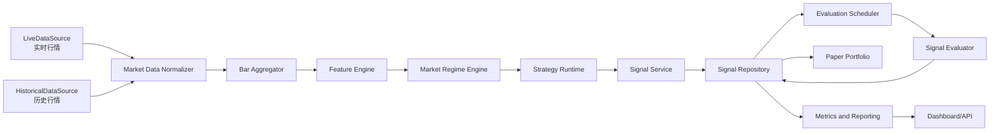
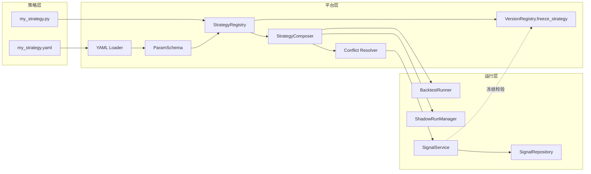
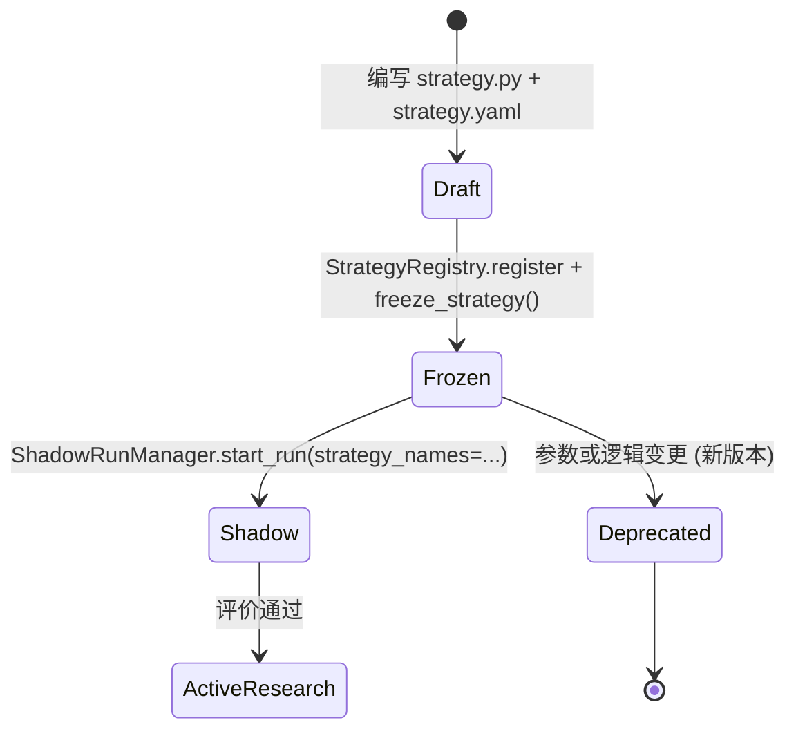
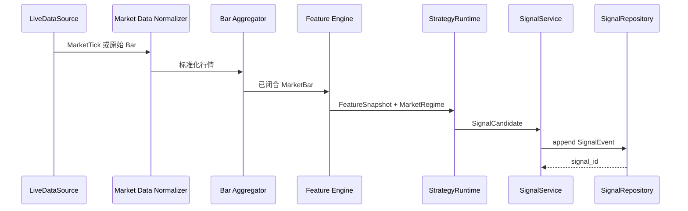
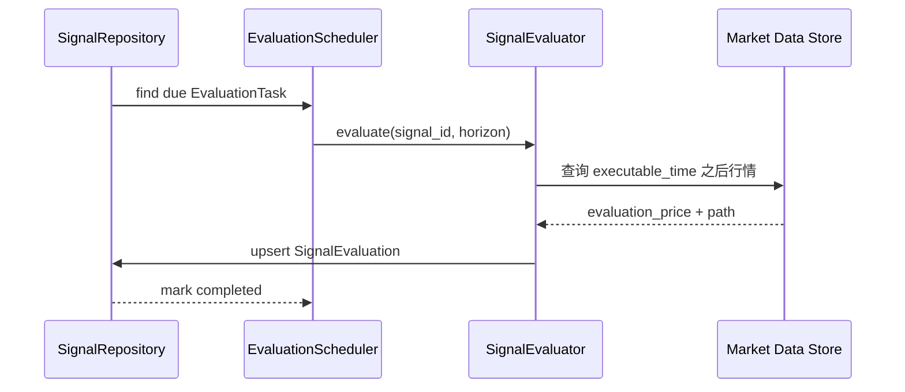
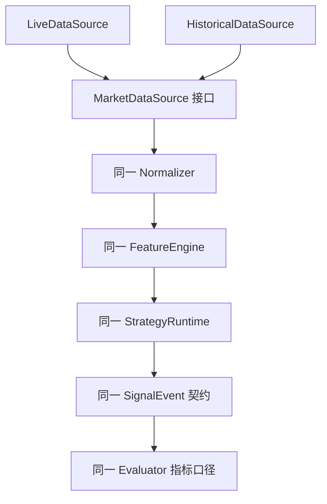

# 短线量化交易建议系统开发指导文档

## 1. 文档信息与状态

| 项目 | 内容 |
| --- | --- |
| 文档状态 | 建议方案 |
| 适用范围 | 短线量化交易建议与有效性评价系统 |
| 当前阶段 | 文档重构与架构设计 |
| 最后更新 | 2026-07-03 |
| 入口文档 | 本文档 |
| 详细专题 | [系统上下文](./system-context.md)、[模块设计](./module-design.md)、[数据契约](./data-contracts.md)、[数据源规划](./market-data-sources.md)、[测试与评价](./testing-and-evaluation.md)、[策略插件指南](./strategy-plugin-guide.md)、[术语表](../glossary.md)、[开放问题](../decisions/open-questions.md) |

## 2. 执行摘要

已确定：本系统用于短线量化信号研究、延迟评价、历史回放、离线回测、实时影子运行和模拟持仓分析。系统输出研究性的 `Buy`、`Sell`、`Hold` 建议，不连接真实券商账户，不自动执行真实交易，不把回测或影子运行结果描述为收益承诺。

建议方案：第一版采用模块化单体或少量进程内模块，聚焦少量股票、分钟级行情、规则策略基线、可恢复延迟评价和实时与回放一致性验证。后续只有在数据量、团队协作和运维压力真实出现后，再拆分独立服务或引入复杂事件平台。

建议方案：A 股低成本分钟级数据源先采用“双数据源 + 本地标准化仓库 + 数据质量对账”，以 `AKShare` 做探索和补充校验，以 `Tushare` 做主历史数据候选；长期稳定影子运行前再评估 `RQData` / `JQData`。详见[数据源规划](./market-data-sources.md)。

待决策：行情供应商最终授权、交易日历来源、数据库最终选型、手续费与滑点参数、Dashboard/API 形态、真实交易扩展时机仍未确定，统一记录在[开放问题](../decisions/open-questions.md)。

## 3. 背景与问题陈述

现有方案已经覆盖信号生成、特征工程、有效性评价、回测、实时影子运行和模拟持仓，但更接近单篇研究方案。为了支持后续工程实现、架构评审、测试验收和新成员接手，需要重构为一组职责清晰的设计文档。

本次重构的重点不是寻找“更高收益”的策略，而是建立一套不会自欺欺人的实验体系：信号在产生时保存，评价基于信号之后现实可获得的价格，实时与历史回放复用同一策略核心，所有版本和参数可追踪，所有未确定事项明确标为待决策。

## 4. 目标与非目标

### 4.1 目标

- 已确定：实时监测指定股票，生成研究性的 `Buy`、`Sell`、`Hold` 信号。
- 已确定：保存信号产生时的行情、特征、版本、参数和价格快照。
- 已确定：在多个未来时间窗口评价信号有效性。
- 已确定：支持历史回放、离线回测、实时影子运行和模拟持仓。
- 建议方案：第一版以少量股票、1 分钟 `MarketBar`、规则策略和可解释指标为主。
- 建议方案：评价同时输出系统正确性指标和信号质量指标。
- 建议方案：所有核心流程支持可复现、可审计、可恢复。

### 4.2 非目标

- 已确定：不连接真实券商账户。
- 已确定：不自动下单，不自动执行真实交易。
- 已确定：不把 `Sell` 默认解释为 A 股做空；除非另行定义，`Sell` 表示减仓、清仓、停止加仓或风险规避。
- 已确定：不修改历史 `SignalEvent`，策略变化只能产生新版本信号。
- 建议方案：第一版不建设复杂微服务、实时流计算平台或复杂组合优化系统。
- 建议方案：第一版不以深度学习模型作为起点，优先用规则策略验证数据、评价和回放链路。

## 5. 需求概述

### 5.1 功能需求

| 编号 | 状态 | 需求 | 验收方式 |
| --- | --- | --- | --- |
| FR-01 | 已确定 | 标准化实时或历史行情为 `MarketTick` / `MarketBar` | 数据契约测试覆盖字段、时间戳和去重 |
| FR-02 | 已确定 | 基于已闭合行情生成 `FeatureSnapshot` | 单元测试证明不使用未来或未闭合 K 线 |
| FR-03 | 已确定 | 通过 `StrategyRuntime` 生成 `SignalEvent` | 信号字段完整且 append-only |
| FR-04 | 已确定 | 生成并恢复 `EvaluationTask` | 服务重启后可发现未完成评价 |
| FR-05 | 已确定 | 写入 `SignalEvaluation` | 同一 `signal_id` 和窗口幂等写入 |
| FR-06 | 建议方案 | 支持历史回放与实时影子对账 | 同一输入、同一版本下输出可比较 |
| FR-07 | 建议方案 | 支持简单 `PaperPortfolio` | Buy/Sell/Hold、成本和重复信号行为可测试 |

### 5.2 非功能需求

| 能力 | 状态 | 要求 |
| --- | --- | --- |
| 正确性 | 已确定 | 禁止前视偏差、数据泄漏、未来修订数据和未闭合 K 线 |
| 可复现性 | 已确定 | 保存策略版本、特征版本、参数哈希、代码版本或等价复现信息 |
| 可解释性 | 建议方案 | 信号保存 `reason_codes`、关键特征和市场状态 |
| 可恢复性 | 建议方案 | 评价任务通过扫描式发现恢复，避免只依赖内存定时器 |
| 可观测性 | 建议方案 | 记录数据延迟、信号耗时、评价积压、缺失 Bar、重复事件和回放差异 |
| 性能 | 待决策 | 具体延迟和吞吐目标需通过基准测试确定 |
| 安全 | 待决策 | 访问控制、数据授权和审计策略需结合部署环境确定 |

## 6. 设计原则

1. 已确定：信号研究、模拟成交和真实交易必须明确分层。
2. 已确定：评价价格必须是信号产生后现实可获得的价格。
3. 已确定：实时和回测必须复用相同的特征与策略核心。
4. 已确定：`SignalEvent` 只追加，不覆盖，不修订。
5. 建议方案：第一版保留模块边界，但使用模块化单体降低运维复杂度。
6. 建议方案：所有评价报告必须同时展示失败、成本、延迟、MFE、MAE 和分桶结果。
7. 建议方案：复杂模型必须在数据、评价、回放和影子运行链路稳定后再引入。

## 7. 总体架构

建议方案：上图表示逻辑模块，不表示第一版必须拆成独立服务。第一版可在一个进程或少量 Worker 内实现，使用清晰接口隔离数据源、策略核心、存储和评价。

### 7.1 策略插件调度与版本冻结

已确定：策略变更必须通过新版本（新的 `strategy_version` 或 `parameter_hash`）表达；不允许原地修改历史 `SignalEvent`。详见 [策略插件指南](./strategy-plugin-guide.md)。

## 8. 核心流程总览

### 8.1 实时信号链路

### 8.2 延迟评价链路

### 8.3 历史回放与实时共用核心

已确定：同一输入、同一策略版本、同一特征版本、同一参数哈希应产生可解释的一致结果。实时不可完全消除的差异包括行情到达延迟、乱序、供应商修订、真实盘口流动性和系统时钟误差。

## 9. 实施阶段

| 阶段 | 状态 | 目标 | 交付物 | 明确不做 | 进入下一阶段门槛 |
| --- | --- | --- | --- | --- | --- |
| 1 | 建议方案 | 建立行情、存储、评价基础设施 | `MarketBar`、`SignalEvent`、`SignalEvaluation`、延迟评价 | 不追求策略有效 | 数据契约和评价幂等测试通过 |
| 2 | 建议方案 | 建立规则策略基线 | 放量突破、缩量回调、冲高回落等可解释策略 | 不引入复杂 ML | 信号可解释且可复现 |
| 3 | 建议方案 | 完成历史回放与回测 | 回放 Runner、成本模型、偏差检查 | 不宣传收益 | Golden replay 与回测正确性测试通过 |
| 4 | 建议方案 | 实时影子运行 | 实时记录、延迟评价、回放对账报告 | 不真实交易 | 未解释实时/回放差异归零或记录为已知限制 |
| 5 | 建议方案 | 验证连续信号影响 | `PaperPortfolio`、`PaperOrder`、`PaperFill` | 不做复杂组合优化 | 仓位状态和成本行为可测试 |
| 6 | 建议方案 | 试验机器学习模型 | 训练/验证流程、Walk-Forward 报告 | 不替代正确性约束 | 样本外验证和置信度校准通过 |
| 7 | 待决策 | 可选真实交易扩展 | 风控、审批、券商接口、隔离账户 | 未决策前不实施 | 需单独设计评审 |

## 10. 风险与权衡

| 风险 | 状态 | 影响 | 缓解 |
| --- | --- | --- | --- |
| 前视偏差 | 已确定 | 直接使评价失真 | 严格时间语义、未闭合 Bar 禁用、测试覆盖 |
| 回测与实时分叉 | 已确定 | 影子结果不可解释 | 共用策略核心、实时/回放对账 |
| 成本低估 | 已确定 | 信号质量被高估 | 费用、税、价差、滑点、延迟纳入评价 |
| 过早微服务化 | 建议方案 | 运维复杂度超过收益 | 第一版模块化单体 |
| 数据供应商不确定 | 待决策 | 影响字段、时区、授权和修订策略 | 放入开放问题，接口隔离供应商 |
| 性能目标无依据 | 待决策 | 容易写出虚假目标 | 先建立基准测试再确定目标 |

## 11. 验收标准

- 已确定：文档正文使用中文，类名、接口名、事件名和字段名使用英文。
- 已确定：系统边界、非目标、研究信号/模拟成交/真实交易边界清晰。
- 已确定：模块职责、输入、输出、依赖、失败模式、恢复方式和测试边界明确。
- 已确定：核心数据契约覆盖时间语义、价格语义、不可变性、版本化和数据所有权。
- 已确定：实时、历史回放、回测、延迟评价、模拟持仓和实时对账链路均有说明。
- 已确定：测试策略覆盖系统正确性、量化正确性、回放一致性、故障恢复和信号评价。
- 已确定：事实、建议方案和待决策事项明确区分。
- 已确定：文档不宣称收益，不使用未来数据、未来修订数据或信号时刻尚未闭合的 K 线作为评价依据。

## 12. 复核记录

| 复核类型 | 状态 | 主要结论 | 已处理修订 |
| --- | --- | --- | --- |
| 架构复核 | 已确定 | 模块化单体方向合理，但需强化数据版本、评价版本和不可变事实边界 | 已补充 `MarketDataRepository`、数据版本键、评价幂等键和派生生命周期说明 |
| 量化正确性复核 | 已确定 | 需避免 `Sell` 被误读为做空收益，且不可执行样本不能静默剔除 | 已补充 `signal_action`、`exposure_effect`、`execution_status`、不可执行样本报告和路径冲突规则 |
| 测试与可运维性复核 | 已确定 | 评价任务恢复、告警和验收门槛需要可执行 | 已补充 `EvaluationTask` 租约、故障注入用例、指标口径、告警要求和最小 runbook |
| 文档一致性复核 | 已确定 | 目标文件齐全，需补齐部分契约、链接和状态标注 | 已补充 `MarketTick`、`MarketRegime` 契约、相关文档链接和状态前缀 |
