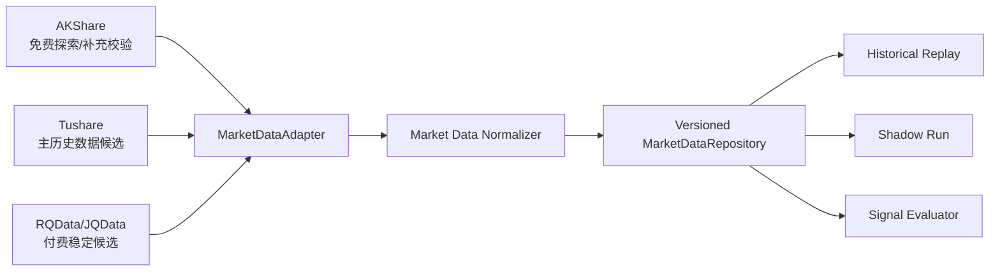

# A 股低成本分钟级数据源规划

相关文档：[开发指导](./development-guide.md)、[模块设计](./module-design.md)、[数据契约](./data-contracts.md)、[测试与评价](./testing-and-evaluation.md)、[开放问题](../decisions/open-questions.md)

## 1. 结论

已确定：第一版以 A 股为主、低成本分钟级、研究与影子评价为目标，不连接真实券商账户，不自动执行真实交易，不把回测或影子运行结果描述为收益承诺。

建议方案：采用“双数据源 + 本地标准化仓库 + 数据质量对账”路线。`AKShare` 用于免费探索和补充校验，`Tushare` 作为主历史数据候选；若进入更稳定的长期影子运行，再评估 `RQData` 或 `JQData`。

## 2. 数据源分层

| 层级 | 状态 | 候选 | 用途 | 第一版处理 |
| --- | --- | --- | --- | --- |
| `Tier 0 / Exploration` | 建议方案 | `AKShare` | 字段摸底、样例 fixture、交叉验证 | 不作为唯一评价价格来源 |
| `Tier 1 / Research Baseline` | 建议方案 | `Tushare` | 主历史数据候选、交易日历和基础信息候选 | 分钟权限和保存授权待决策 |
| `Tier 2 / Stable Shadow Candidate` | 待决策 | `RQData`、`JQData` | 稳定分钟、tick、停牌、复权和行业数据候选 | 进入长期影子运行前评估 |
| `Tier 3 / Broker/Terminal Adapter` | 待决策 | 富途、QMT、掘金 | 带交易能力平台的行情接口 | 只保留行情 Adapter 口，不启用真实交易 |

已确定：第一版不把 `yfinance`、`Alpha Vantage`、`Alpaca`、`Polygon`、`IBKR` 作为主线数据源；它们更偏美股或全球市场，后续多市场扩展再评估。

## 3. 实现约束

- 已确定：所有供应商数据必须先映射为内部 `MarketBar` / `MarketTick`，策略核心不得依赖供应商 SDK 或供应商字段。
- 已确定：所有外部数据先落本地版本化仓库，再驱动回放、影子运行和评价；评价不得直接在线请求供应商接口。
- 已确定：标准化 Bar 的版本键为 `(symbol, timeframe, market_data_time, data_source_version, as_of_version)`。
- 已确定：同一版本键的重复写入必须幂等；若内容不同，必须进入 quarantine 或报错，不得覆盖旧事实。
- 建议方案：`DataSourceProfile` 记录 `provider`、`market`、`frequency`、`adjustment`、`permission_level`、`data_source_version`、`as_of_version`、授权备注和保存限制。
- 建议方案：供应商对账至少比较 OHLCV、复权口径、时间戳语义和缺失 Bar；差异写入报告，不静默修正。

## 4. 测试与验收

- 契约测试：Adapter 输出字段完整，时间戳、时区、成交量单位、复权口径和版本字段必填。
- 防前视测试：未闭合 1 分钟 Bar 不允许进入特征和策略；复权、指数成分、行业数据必须通过 `available_at` 或 `as_of_version` 校验。
- 回放一致性测试：同一标准化数据重复回放输出一致；迟到或修订数据只能产生新版本，不能覆盖历史事实。
- 数据质量测试：缺失、重复、乱序、停牌、半日市、涨跌停、供应商字段变化样例必须进入 quarantine 或对账报告。
- 供应商验收：建议抽样 20 只 A 股、近 60 个交易日、1 分钟和日线数据，对比 `AKShare + Tushare`；预算允许时加入 `RQData/JQData`。

## 5. 当前实现

已确定：当前代码已实现 `AKShareMarketDataSource`。该 Adapter 懒加载 `akshare`，支持 A 股 `1m`、`5m`、`15m`、`30m`、`60m` 和 `1d` Bar，统一解释 AKShare 返回的本地市场时间并转为 UTC 后写入内部 `MarketBar`。

已确定：当前代码还实现了供应商隔离、标准化契约、内存和 SQLite 版本化仓库、quarantine、历史回放读取、单源 AKShare 验收、信号/评价/回测/模拟持仓和影子对账骨架。尚未接入真实 `Tushare`、`RQData` 或 `JQData` SDK，也未实施双源对账。

建议方案：真实运行前通过 `python -m pip install -r requirements-akshare.txt` 安装 `akshare`，并先用少量股票和短时间窗口执行离线验收，不直接把 AKShare 结果作为唯一评价价格来源。

待决策：是否付费开通 Tushare 历史分钟或实时分钟权限。

待决策：是否评估 `RQData` / `JQData` 的个人授权、数据保存限制和成本。

待决策：是否需要 tick 数据；第一版规则基线默认先用已闭合 1 分钟 Bar。
