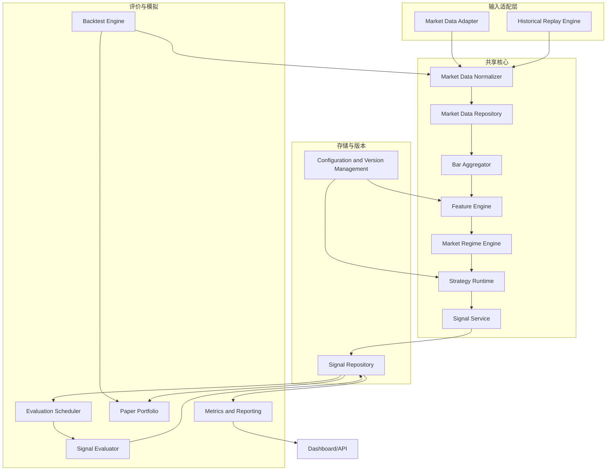
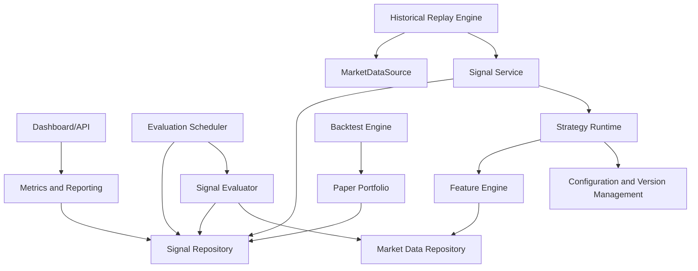

# 模块职责与依赖设计

相关文档：[开发指导](./development-guide.md)、[系统上下文](./system-context.md)、[数据契约](./data-contracts.md)、[测试与评价](./testing-and-evaluation.md)、[术语表](../glossary.md)、[开放问题](../decisions/open-questions.md)

## 1. 总体模块策略

已确定：模块边界必须清晰，实时和回测必须共用同一特征与策略核心。

建议方案：第一版采用模块化单体。各模块通过接口隔离职责，但不把每个能力机械拆成独立服务。未来只有当数据量、延迟、团队协作或故障隔离压力真实出现时，再拆分 `MarketDataIngestion`、`EvaluationWorker`、`Dashboard/API` 等独立进程。

## 2. 运行数据流图



建议方案：上图是运行时数据流，不等同于代码依赖方向。

## 3. 调用依赖图



已确定：依赖图中调用方指向被依赖接口。策略核心不得依赖数据库、UI、真实行情 SDK 或 Dashboard。

## 4. 核心接口

```text
MarketDataSource.read(from_time, to_time, symbols) -> Iterable[MarketTick | MarketBar]
MarketDataRepository.save_bar(bar: MarketBar) -> void
MarketDataRepository.read_bars(symbol, from_time, to_time, data_source_version, as_of_version) -> Iterable[MarketBar]
FeatureEngine.update(bar: MarketBar) -> FeatureSnapshot
StrategyRuntime.on_bar(bar: MarketBar, snapshot: FeatureSnapshot, regime: MarketRegime) -> SignalCandidate | None
SignalRepository.append_signal(event: SignalEvent) -> signal_id
EvaluationScheduler.find_due_tasks(now) -> list[EvaluationTask]
SignalEvaluator.evaluate(task: EvaluationTask) -> SignalEvaluation
PaperPortfolio.apply_signal(event: SignalEvent, fill_model: FillModel) -> list[PaperOrder | PaperFill]
```

建议方案：接口名称表达职责，不要求第一版以这些确切类名实现。实现时不得让策略核心直接依赖数据库、UI、真实行情 SDK 或 Dashboard。

### 4.1 接口错误模型和顺序保证

| 接口 | 状态 | 顺序保证 | 幂等键 | 重试责任 |
| --- | --- | --- | --- | --- |
| `MarketDataSource` | 建议方案 | 单 symbol 内按 `market_data_time` 输出；乱序必须显式标记 | `(source, symbol, market_data_time, source_sequence, data_source_version)` | Adapter 重连，Normalizer 去重 |
| `MarketDataRepository` | 已确定 | 查询按 `market_data_time` 升序 | `(symbol, timeframe, market_data_time, data_source_version, as_of_version)` | 写入者重试，重复写无副作用 |
| `SignalRepository` | 已确定 | append 顺序不代表市场顺序，查询必须显式排序 | `signal_id`、`(signal_id, horizon, evaluation_policy_version, data_source_version)` | 调用方重试，Repository 保证幂等 |
| `SignalEvaluator` | 已确定 | 使用 `[executable_time, evaluation_time]` 路径 | `(signal_id, horizon, evaluation_run_id)` | Scheduler 负责 claim 和重试 |

## 5. 模块设计表

| 模块 | 状态 | 职责 | 非职责 | 输入 | 输出 | 所有权数据 | 依赖 | 失败模式与恢复 | 幂等性与测试边界 | 形态 |
| --- | --- | --- | --- | --- | --- | --- | --- | --- | --- | --- |
| Market Data Adapter | 建议方案 | 接入实时或历史行情源，转换为内部输入 | 不计算特征，不生成信号 | 原始 Tick/Bar | `MarketTick` / 初步 `MarketBar` | 原始接入元数据 | 行情源、交易日历 | 断流、乱序、重复；通过重连、去重、隔离异常恢复 | 以供应商事件 ID 或 `(symbol, market_data_time, source_sequence)` 去重；契约测试覆盖字段 | 进程内模块，未来可拆 |
| Market Data Normalizer | 已确定 | 统一时间戳、时区、价格精度、成交量、交易状态 | 不补造不可见数据，不修正未来数据 | `MarketTick` / 原始 Bar | 标准化 `MarketTick` / `MarketBar` | 标准化行情 | Adapter、交易日历 | 字段缺失、时区错误；异常进入 quarantine | 同一输入输出一致；负例测试覆盖无效时间和缺失字段 | 共享核心 |
| Market Data Repository | 已确定 | 保存标准化行情、quarantine 数据和数据版本 | 不生成特征，不评价信号 | 标准化 Tick/Bar、异常数据 | 可版本化行情查询 | 标准化行情、异常隔离区 | Normalizer、Bar Aggregator | 重复写、版本冲突；按版本键 append-only | 数据版本键幂等，迟到数据不覆盖旧版本 | 进程内适配，未来可独立 |
| Bar Aggregator | 建议方案 | 从 Tick 或低层数据生成已闭合分钟 Bar | 不让未闭合 Bar 进入策略 | 标准化 Tick | 已闭合 `MarketBar` | Bar 边界状态 | Normalizer、交易日历 | Tick 乱序、迟到；按水位线或重算策略恢复 | `(symbol, timeframe, market_data_time, data_source_version, as_of_version)` 幂等 | 共享核心 |
| Feature Engine | 已确定 | 计算只依赖历史和已闭合 Bar 的特征 | 不访问未来价格，不训练模型 | `MarketBar`、历史窗口 | `FeatureSnapshot` | 特征版本、窗口状态 | Bar Aggregator、配置版本 | 缺失窗口、状态丢失；从已持久化 Bar 重建 | Golden fixture 验证无前视 | 共享核心 |
| Market Regime Engine | 建议方案 | 生成趋势、震荡、放量、缩量等市场状态 | 不直接决定交易动作 | 特征、指数/板块数据 | `MarketRegime` | 状态规则版本 | Feature Engine | 板块数据缺失；输出 UNKNOWN 并记录 | 相同输入确定性输出 | 共享核心 |
| Strategy Runtime | 已确定 | 调用策略核心生成候选信号 | 不写数据库，不查询 UI | Bar、特征、市场状态、配置 | `SignalCandidate` | 策略运行状态 | Feature Engine、CVM | 配置错误、策略异常；隔离单策略失败 | 同输入同版本同输出 | 共享核心 |
| Signal Service | 已确定 | 校验候选信号，补齐时间和价格语义，创建 `SignalEvent` | 不评价收益，不改历史信号 | `SignalCandidate`、可执行价格模型 | `SignalEvent` | `signal_id` 生成规则 | Strategy Runtime、Repository | 字段缺失、价格不可用；拒绝或标记不可执行 | `signal_id` 或事件哈希防重复 | 共享核心 |
| Signal Repository | 已确定 | 持久化信号、评价、版本和查询 | 不实现策略规则 | `SignalEvent`、`SignalEvaluation` | 查询结果 | 信号和评价事实 | 存储 | 写失败、重复写、部分写；事务和幂等恢复 | `SignalEvent` append-only；评价 upsert | 进程内适配，未来可独立 |
| Evaluation Scheduler | 建议方案 | 发现、领取和恢复到期评价任务 | 不计算评价指标 | 信号、当前时间、评价窗口 | `EvaluationTask` | 任务状态、租约、重试信息 | Repository | Worker 崩溃、租约过期；扫描并重新领取 | `(signal_id, horizon, evaluation_policy_version)` 唯一 | Worker 模块 |
| Signal Evaluator | 已确定 | 计算固定窗口、MFE、MAE、三重障碍和成本后结果 | 不生成新信号 | `EvaluationTask`、行情路径、成本模型 | `SignalEvaluation` | 评价算法版本 | Repository、Market Data Repository | 缺少评价价格；任务延期或标记不可评价 | 同任务重复执行结果一致 | Worker 模块 |
| Historical Replay Engine | 已确定 | 按历史时间顺序重放行情，驱动共享核心 | 不使用未来修订数据 | 历史行情快照 | `SignalEvent`、对账报告 | replay run metadata | DataSource、共享核心 | 数据缺口、顺序错误；停止或隔离批次 | Golden replay 输出稳定 | CLI/批处理 |
| Backtest Engine | 建议方案 | 在回放信号基础上模拟成本、成交和组合结果 | 不替代真实交易 | 信号、Bar、成本、成交模型 | 回测报告、Paper 状态 | backtest run metadata | Replay、PaperPortfolio | 成交约束缺失；报告标记假设 | Golden case 验证成本和方向 | CLI/批处理 |
| Paper Portfolio | 建议方案 | 维护模拟订单、成交和持仓 | 不表示真实持仓 | 信号、成交模型、成本参数 | `PaperOrder`、`PaperFill`、`PaperPosition` | 模拟持仓事实 | Repository、Backtest | 重复信号、部分成交；幂等事件处理 | 状态机测试 | 进程内模块 |
| Metrics and Reporting | 建议方案 | 聚合系统正确性和信号质量指标 | 不修改事实数据 | 信号、评价、版本、运行元数据 | 报告、指标 | 派生聚合 | Repository | 缺数据；展示样本量和未知项 | 聚合可重算 | 进程内或批处理 |
| Dashboard/API | 待决策 | 展示实时建议、历史统计和系统状态 | 不写策略事实 | 查询请求 | 页面或 API 响应 | 无事实所有权 | Reporting、Repository | 查询慢、展示失败；不影响核心链路 | API 契约测试 | 未来可独立 |
| Configuration and Version Management | 已确定 | 管理策略版本、参数、特征版本、代码版本 | 不决定策略有效性 | 配置、模型文件、代码版本 | `StrategyVersion`、参数哈希 | 版本事实 | 文件/数据库/代码仓库 | 配置漂移；启动时校验 | 配置哈希稳定 | 共享基础模块 |

## 6. 关键流程

### 5.1 策略版本升级

已确定：

1. 新策略或参数变更必须生成新的 `StrategyVersion` 或 `parameter_hash`。
2. 历史 `SignalEvent` 不修改。
3. 新版本开始运行后，信号和评价按版本分组展示。
4. 历史回放可以用新版本重新生成新的 replay run，但不得覆盖旧版本信号。

### 5.2 服务重启后的评价恢复

建议方案：

1. `EvaluationScheduler` 周期性查询已到期但未完成的 `(signal_id, horizon)`。
2. `EvaluationScheduler` 通过事务或等价机制执行 `claim due task`，写入 `claimed_at`、`lease_expires_at` 和 `worker_id`。
3. `SignalEvaluator` 计算结果后使用幂等键写入 `SignalEvaluation`。
4. 只有评价写入成功后，任务才能标记 `COMPLETED`。
5. 如果行情尚不可用，任务标记 `POSTPONED`，写入 `next_retry_at` 和原因。
6. 如果进程在领取后崩溃，租约过期后任务重新进入可领取状态。
7. 重启后通过持久化任务状态和 Repository 差集扫描恢复，不依赖内存定时器。

### 5.3 实时结果与历史回放对账

建议方案：

1. 固定同一时间段的实时标准化 Bar。
2. 使用同一 `strategy_version`、`feature_version`、`parameter_hash` 回放。
3. 比较信号数量、`signal_id`、方向、分数、置信度、特征快照和时间戳差异。
4. 未解释差异视为系统缺陷，除非记录为行情延迟、数据修订、交易状态或时钟差异。

## 7. 复杂度边界

建议方案：

- 保留模块接口，不提前引入 Kafka、Flink、多服务编排或复杂服务治理。
- 把正确性、可复现性和恢复能力优先于策略复杂度。
- 对可拆分能力标注未来方向，但第一版默认进程内实现。
