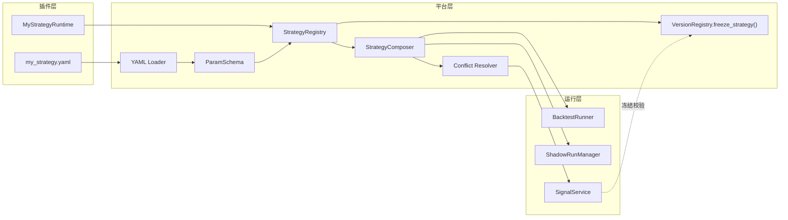

# 策略可插拔平台接入指南

本文档说明如何在 `quant_signal_system` 中新增一个策略，以及如何通过注册表、YAML 参数和版本冻结机制让新策略被 `BacktestRunner`、`ShadowRunManager` 与 `SignalService` 同时复用。

## 1. 范围与非目标

- 已确定：本指南只覆盖研究性 `Buy / Sell / Hold` 信号的策略层插件化；不包含真实下单、风控或券商对接。
- 已确定：实时影子运行、离线回测、历史回放必须复用同一策略核心。
- 建议方案：策略以 Python 类形式提供，参数以 YAML 文件或内联映射形式提供，元信息（`strategy_name` / `strategy_version` / `code_version` / `parameter_hash`）由平台冻结并校验。

## 2. 顶层结构



## 3. 新增策略需要交付什么

| 文件 | 是否必须 | 作用 |
| --- | --- | --- |
| `src/quant_signal_system/strategies/<name>.py` | 是 | 策略实现（frozen dataclass + `on_bar` + `param_schema()` + `from_params()`） |
| `src/quant_signal_system/strategies/<name>.yaml` | 建议 | 默认参数文件，与 `.py` 同目录 |
| `tests/strategies/test_<name>.py` | 是 | 单元测试：参数解析、信号方向、A 股语义、冻结校验 |

`StrategyRuntime` 是结构化协议（`typing.Protocol` + `@runtime_checkable`），并不强制继承。只需要实现以下成员即可通过 `isinstance(runtime, StrategyRuntime)`：

```python
@property
def name(self) -> str: ...
@property
def version(self) -> str: ...
@property
def code_version(self) -> str: ...
@property
def parameter_hash(self) -> str: ...
@property
def horizon_seconds(self) -> int: ...

def on_bar(bar, snapshot, regime=None) -> SignalCandidate | None: ...
def declare_parameters(self) -> tuple[tuple[str, object], ...]: ...
```

## 4. 最小可用示例

`src/quant_signal_system/strategies/_examples/momentum_v1.py` 已经提供了一份可参考的实现，配套 `momentum_v1.yaml`。完整运行链路如下：

```python
from pathlib import Path

from quant_signal_system.config.versions import VersionRegistry
from quant_signal_system.signals.service import SignalService
from quant_signal_system.strategies import DEFAULT_REGISTRY, StrategyComposer
from quant_signal_system.strategies._examples.momentum_v1 import MomentumV1Strategy
from quant_signal_system.time.clock import SystemClock

# 1. 注册策略到默认注册表（或自定义注册表）。
version_registry = VersionRegistry()
registry = DEFAULT_REGISTRY  # 进程内单例
yaml_path = Path(__file__).with_name("momentum_v1.yaml")
registry.register(MomentumV1Strategy, yaml_path=yaml_path)

# 2. 按名解析为运行时实例。
runtime = registry.get("momentum-v1")

# 3. 注入到回测或影子运行。
composer = StrategyComposer.single(runtime)
signal_service = SignalService(SystemClock(), version_registry=version_registry)
```

YAML 与 `.py` 同名同目录（`strategies/momentum_v1.yaml`）：

```yaml
return_threshold: 0.005
horizon_seconds: 900
```

任何字段缺省时使用 `ParamSchema` 中声明的默认值；任何未知字段在加载阶段就会触发 `SchemaError`。

## 5. 接入到 `BacktestRunner`

`BacktestRunner` 同时支持旧式 `StrategyRuntime` 入参与新的 `StrategyComposer`。最简洁的写法是通过 `BacktestRunner.create_default()`：

```python
from quant_signal_system.backtest.runner import BacktestRunner
from quant_signal_system.features.engine import RollingFeatureEngine
from quant_signal_system.signals.repository import InMemorySignalRepository
from quant_signal_system.signals.service import SignalService
from quant_signal_system.strategies import DEFAULT_REGISTRY

runner = BacktestRunner.create_default(
    feature_engine=RollingFeatureEngine(clock=clock),
    signal_service=SignalService(clock, version_registry=registry.version_registry),
    signal_repository=InMemorySignalRepository(),
    runtime=DEFAULT_REGISTRY.get("momentum-v1"),
)
```

如果要在同一根 K 线上跑多个策略，传入一个 `StrategyComposer`：

```python
composer = StrategyComposer(
    runtimes=(
        DEFAULT_REGISTRY.get("baseline-rules"),
        DEFAULT_REGISTRY.get("momentum-v1"),
    ),
)
runner = BacktestRunner(feature_engine, composer, signal_service, signal_repo)
```

## 6. 接入到 `ShadowRunManager`

`ShadowRunManager.start_run()` 现在接受 `strategy_names: tuple[str, ...]`，从注册表按名解析并构造 `StrategyComposer`。`ShadowRunState.strategy_versions` 会记录每个策略的 `name@version@parameter_hash@code_version` 复合键，便于审计：

```python
state = shadow_manager.start_run(
    symbol="000001",
    timeframe="1m",
    from_time=datetime(...),
    to_time=datetime(...),
    strategy_names=("baseline-rules", "momentum-v1"),
)
```

未注册的名字会触发 `KeyError`，运行不会启动。

## 7. 冲突与多策略调度

`StrategyComposer` 支持三种冲突解决策略：

| 策略 | 行为 | 适用场景 |
| --- | --- | --- |
| `PRIORITY_MAX_CONFIDENCE`（默认） | 优先级最高胜出；冲突时同方向才比较 confidence | 主策略 + 过滤器组合 |
| `UNANIMOUS` | 所有策略同向同动作才放行 | 多策略共识 |
| `SCORE_WEIGHTED` | `Σ(score × weight)` 加权后取符号 | 多模型集成 |

`PRIORITY_MAX_CONFIDENCE` 下的 BUY vs SELL 冲突会让 composer 返回 `None` 并通过 `ComposerConflictRecord` 记录决策原因，便于回放与监控。

## 8. 版本冻结与 `SignalService`

`StrategyRegistry.register()` 在内部调用 `VersionRegistry.freeze_strategy(strategy_name, strategy_version, parameter_hash, code_version)`，并将四个字段作为复合键存入只读表。`SignalService` 在 `create_event(candidate)` 中可选地校验 candidate 上的四个字段是否在冻结表中存在（通过 `SignalService(version_registry=...)` 启用；未启用时保留旧的 fail-open 行为）。

任何 `(name, version, parameter_hash, code_version)` 的变更都会产生新的 frozen identity，旧的 `SignalEvent` 仍然保留（append-only），但任何与新身份不一致的 candidate 都会被 `SignalService` 拒绝。

## 9. YAML 与 JSON 的差异

- YAML 文件按字符串前缀判断：`{` / `[` 开头 → 解析为 JSON；否则视为路径。
- 内联 JSON 字符串、`Mapping` 对象、YAML 路径三种输入走同一条 `load_params(payload, schema)` 入口。
- 缺字段用 schema 默认值；多余字段触发 `SchemaError`，不会进入注册表。

## 10. 失败模式与恢复

| 场景 | 行为 |
| --- | --- |
| 重复注册同名不同身份 | `DuplicateStrategyError`，原注册保留 |
| 重复注册同名同身份 | 幂等返回原 `StrategySpec` |
| YAML 字段未声明 | `SchemaError`，不进入注册表 |
| YAML 文件不存在 | `SchemaError("parameter source path does not exist")` |
| 影子运行传入未注册名字 | `KeyError`，run 状态变为 `FAILED` |
| 多策略方向冲突（默认策略下） | composer 记录 `ComposerConflictRecord` 后返回 `None` |

## 11. 测试策略

新增一个策略至少要覆盖：

1. 参数解析：默认值、覆盖值、未知字段、类型转换。
2. `param_hash` 稳定性：相同参数 → 相同哈希；任意参数变更 → 哈希变更。
3. `isinstance(runtime, StrategyRuntime)` 为真。
4. `on_bar` 在缺失数据时返回 `None`。
5. `SignalService` 在开启版本注册表时接受该策略；未冻结时拒绝。
6. `BacktestRunner` 端到端至少生成一个 `SignalEvent`。

参考实现见 `src/quant_signal_system/strategies/_examples/momentum_v1.py` 与 `tests/strategies/test_*`。