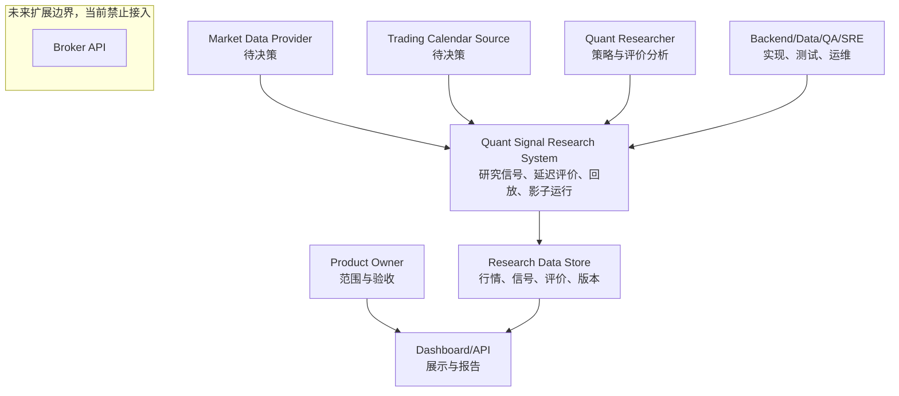

# 系统上下文与边界

相关文档：[开发指导](./development-guide.md)、[模块设计](./module-design.md)、[数据契约](./data-contracts.md)、[测试与评价](./testing-and-evaluation.md)、[术语表](../glossary.md)、[开放问题](../decisions/open-questions.md)

## 1. 设计结论状态

- 已确定：系统用于短线量化交易建议研究与有效性评价。
- 已确定：系统不连接真实券商账户，不自动执行真实交易。
- 已确定：`Sell` 在 A 股语境下默认表示减仓、清仓、停止加仓或风险规避，不默认表示做空。
- 建议方案：第一版以少量股票、分钟级行情和规则策略为主。
- 待决策：行情供应商、交易日历、数据授权、部署环境、访问控制和真实交易扩展时机。

## 2. 系统负责什么

已确定：

- 接收实时或历史行情，并标准化为内部数据契约。
- 对已闭合行情计算特征和市场状态。
- 生成研究性的 `Buy`、`Sell`、`Hold` 信号。
- 持久化 `SignalEvent`、`FeatureSnapshot`、策略版本和评价任务。
- 使用信号产生后现实可获得的价格执行延迟评价。
- 支持历史回放、离线回测、实时影子运行和模拟持仓。
- 生成系统正确性、信号质量、策略版本和分桶统计报告。

## 3. 系统不负责什么

已确定：

- 不提供收益承诺。
- 不管理真实资金账户。
- 不向真实券商账户发送订单。
- 不自动执行真实交易。
- 不将回测最优结果包装为稳定可盈利结论。
- 不修改历史 `SignalEvent`。

建议方案：

- 第一版不承担复杂组合管理、跨市场资产配置、交易审批、实时风控熔断和合规报送。
- 第一版不建设面向大规模股票池的复杂分布式实时计算平台。

## 4. 参与者与外部依赖

| 参与者或系统 | 状态 | 角色 | 输入/输出 |
| --- | --- | --- | --- |
| Quant Researcher | 已确定 | 设计策略、分析评价结果 | 策略配置、评价报告 |
| Backend Engineer | 已确定 | 实现模块、接口、存储和 Worker | 代码、接口、测试 |
| Data Engineer | 已确定 | 接入行情、维护数据质量 | 原始行情、标准化行情 |
| QA/Test Engineer | 已确定 | 验证正确性和可恢复性 | 测试用例、验收报告 |
| SRE/Operator | 已确定 | 运行、监控、恢复系统 | 监控、告警、运行手册 |
| Product Owner | 已确定 | 确认范围、展示和阶段目标 | 需求、验收标准 |
| Market Data Provider | 待决策 | 提供实时和历史行情 | Tick、Bar、交易状态 |
| Trading Calendar Source | 待决策 | 提供交易日、交易时段、停牌等信息 | 日历、时段、状态 |
| Broker API | 待决策 | 未来真实交易扩展接口 | 订单、成交、账户 |

## 5. 系统上下文图

已确定：`Broker API` 只作为未来扩展边界展示，不是当前系统依赖。当前系统不得向真实券商账户发送订单。

## 6. 研究信号、模拟成交和真实交易边界

| 层级 | 状态 | 含义 | 允许行为 | 禁止行为 |
| --- | --- | --- | --- | --- |
| Signal Research | 已确定 | 判断某时点是否产生研究信号 | 生成 `SignalEvent`、记录特征、延迟评价 | 宣称收益或改写历史信号 |
| Paper Trading | 建议方案 | 基于模拟成交模型更新虚拟持仓 | 生成 `PaperOrder`、`PaperFill`、`PaperPosition` | 当作真实成交结果展示 |
| Live Trading | 待决策 | 真实账户下单和成交 | 仅未来单独设计后可能引入 | 当前阶段接入券商和自动下单 |

已确定：真实交易能力即使未来引入，也必须作为独立阶段重新评审，新增风控、权限、审计、人工审批、限额和回滚机制。

## 7. 安全与合规边界

已确定：

- 文档和系统输出应表述为研究性建议或模拟结果。
- 回测、影子运行和模拟持仓结果不得描述为收益保证。
- 历史结果的生成条件、版本、数据来源和评价口径必须可追踪。

待决策：

- 行情数据授权范围、可保存字段、可展示范围。
- 用户身份认证、访问控制和审计日志要求。
- 如果未来接入真实交易，需新增账户权限隔离、订单审批、限额、风控和合规评审。

## 8. 外部依赖失败边界

| 依赖 | 失败模式 | 建议处理 |
| --- | --- | --- |
| 行情源 | 延迟、断流、乱序、重复、字段缺失、修订 | 记录 `ingest_time`，标准化层去重和隔离异常，指标输出缺失率 |
| 交易日历 | 缺失交易日、时段错误、停牌状态不准确 | 固定版本，回放时使用同一版本，差异进入开放问题 |
| 存储 | 写入失败、部分写入、重复写入 | 使用幂等键、事务或补偿扫描 |
| Dashboard/API | 展示失败、查询慢 | 不阻塞信号持久化和评价写入 |
| 未来 Broker API | 拒单、部分成交、状态回报延迟 | 当前不接入；未来单独设计 |
